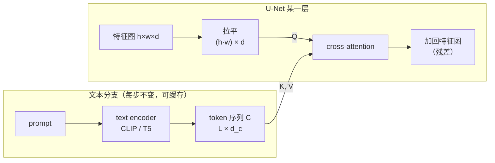
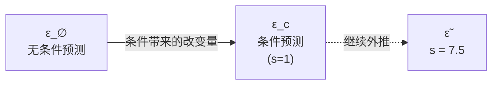

# 条件机制：如何把文本语义注入去噪网络

!!! abstract "这一篇要回答什么"

    - 基础篇的网络是 \(\boldsymbol{\epsilon}_\theta(\mathbf{x}_t,t)\)，只吃带噪图和时间步。多出来的那个 \(\mathbf{c}\) 该从哪儿进去？
    - timestep 是怎么注入的，为什么同一套办法**搬不动文本**？
    - cross-attention 到底让图像的每个位置做了一件什么事，凭什么它能把"语义"分配到正确的空间位置？
    - 有了条件输入，为什么还不够听话，非要再加一个 guidance？guidance scale 调大为什么会过饱和？

    对应论文：ADM / Classifier Guidance (Dhariwal & Nichol, 2021)、GLIDE (Nichol et al., 2021)、Classifier-Free Guidance (Ho & Salimans, 2022)、Latent Diffusion (Rombach et al., 2022)。

!!! note "本篇不涉及 latent"

    独立的 cross-attention 块这个设计出自 LDM，但**文本条件本身不依赖 latent 空间**——GLIDE 早在纯像素空间就做出了可用的文生图。所以这里只谈条件机制，把 \(\mathbf{x}_t\) 当成什么空间里的张量都行；VAE、压缩率、重建-生成权衡那半留给 `latent-diffusion.md`。

    历史顺序也支持这样拆：这条线是 ADM (2021.05) → GLIDE (2021.12) → CFG 论文 (2022.01) → LDM (2022.04)，条件机制的主要零件在 latent 出现之前就已备齐。

## 1. 目标的改变：从 p(x) 到给定条件的 p(x|c)

基础篇全篇在做无条件生成：从纯噪声出发，得到 \(p(\mathbf{x})\) 的一个随机样本——"一张合理的自然图像"，但画什么完全不受控。

现在要的是**条件分布** \(p(\mathbf{x}\mid\mathbf{c})\)，\(\mathbf{c}\) 是一句话。好消息是：基础篇的整套推导**一个字都不用改**。ELBO、闭式解、\(L_{\text{simple}}\)，全部原样成立，只是每一项都多带一个 \(\mathbf{c}\)：

\[
L_{\text{simple}} = \mathbb{E}_{t,(\mathbf{x}_0,\mathbf{c}),\boldsymbol{\epsilon}}\left[\left\|\boldsymbol{\epsilon}-\boldsymbol{\epsilon}_\theta\!\left(\sqrt{\bar\alpha_t}\mathbf{x}_0+\sqrt{1-\bar\alpha_t}\boldsymbol{\epsilon},\ t,\ \mathbf{c}\right)\right\|^2\right]
\]

数据从"图像集合"变成"图文对集合"，损失多一个输入参数，仅此而已。**所有的难点都不在数学上，而在工程上：\(\mathbf{c}\) 究竟以什么形式、在网络的什么位置进去。**

## 2. 先看 timestep 是怎么进去的，以及它为什么不够用

去噪网络其实早就在处理一个条件了——时间步 \(t\)。看它怎么做的，能看清文本的困难在哪。

### 2.1 timestep embedding 与 AdaGN

\(t\) 是个标量，先用正弦位置编码变成向量，过两层 MLP，得到 \(\mathbf{t}_{\text{emb}}\in\mathbb{R}^{d}\)。然后在 U-Net 的**每个**残差块里，把它变成一组缩放/平移系数去调制特征图——这就是 **adaptive group normalization (AdaGN)**：

\[
\text{AdaGN}(\mathbf{h},\mathbf{t}_{\text{emb}}) = \boldsymbol{\gamma}(\mathbf{t}_{\text{emb}})\cdot\text{GroupNorm}(\mathbf{h}) + \boldsymbol{\beta}(\mathbf{t}_{\text{emb}})
\]

\(\mathbf{h}\) 是每个残差块中**第一个卷积之后**的激活，\(\boldsymbol{\gamma},\boldsymbol{\beta}\) 经线性层产生，每个通道一个数。直觉是：**条件不改变"看哪里"，只改变"每个通道的响应强度"**——告诉网络"现在噪声很大，走全局结构；现在噪声很小，抠细节"。

ADM 用同一套机制注入 ImageNet 的类别标签：把 class embedding 与 \(\mathbf{t}_{\text{emb}}\) 合并后一起投影成 \([\boldsymbol{\gamma},\boldsymbol{\beta}]\)。这是 FiLM / AdaIN 家族的老办法，**后面 DiT 的 adaLN-Zero 也是同一条血脉**。

### 2.2 为什么这套搬不动文本

AdaGN 的信息瓶颈极窄：无论条件多复杂，最终只落成**每通道一个标量**。对 \(t\)（一个数）和类别标签（1000 选 1）绰绰有余，对文本则不行，原因有两层：

| | timestep / 类别 | 文本 |
|---|---|---|
| **结构** | 单个标量 / 单个离散符号 | **变长的 token 序列**，有语法和组合结构 |
| **作用方式** | 全局均匀——整张图共享同一组 \(\gamma,\beta\) | **需要空间选择性**——"戴红帽子的猫坐在蓝色椅子上"，"红"要作用到帽子那片像素，"蓝"要作用到椅子那片 |

第二行是致命的。AdaGN 对整张特征图施加同一组系数，它**在空间上是均匀的**，物理上无法表达"这个词管这块区域"。把整句话池化成一个向量再走 AdaGN，等于把 "红帽子 + 蓝椅子" 压成一锅粥，模型只能学到"图里有红有蓝"，属性绑定（attribute binding）必然出错。

所以需要一种机制，能让**图像的每个空间位置各自决定该听哪几个词**。这正是 attention 的定义。

### 2.3 GLIDE：过渡形态

值得单独看一眼，因为它说明"注入方式"是逐步长出来的，而不是一步到位。GLIDE 是 3.5B 的**像素空间**文生图模型（base 64×64，再接一个 1.5B 的扩散上采样模块到 256×256），它把文本过一个 24 层、宽度 2048 的 Transformer，然后**两路并行**注入：

1. **最后一个 token 的 embedding**，放进 ADM 里原本给 class embedding 的那个位置——也就是走 2.1 节的 AdaGN 通路；
2. **整个 token 序列**，投影到各 attention 层的维度后，**拼接到该层已有的 attention context 上**。

第二路是关键的新东西：它保留了序列结构，让空间位置能通过 attention 与具体的词发生关系。但注意实现细节——GLIDE 是把文本 token **拼进已有的 self-attention 上下文**，让图像 token 和文本 token 挤在同一个注意力里，而**不是**一个独立的 cross-attention 块。后者要到 LDM 才定型。

所以 GLIDE 最准确的描述是：**ADM 把类别标签换成文本，再补上序列级的 attention 条件**。它继承了 ADM 的全套条件管线，第 1 路走的就是 2.1 节那个 AdaGN 插槽。

## 3. Cross-attention：让每个像素去查询每个词

LDM 把上面第 2 路提炼成一个专门的模块：不再往 self-attention 里挤，而是在每个 Transformer 块中**单独设一层 cross-attention**，Query 来自图像、Key/Value 只来自文本。职责分离之后，这个设计成了此后所有文生图模型的默认接法。

### 3.1 接线

两步：

1. **文本编码**。整句话过一个预训练 text encoder（CLIP 或 T5），得到 **token 级**的序列表示 \(\mathbf{C}\in\mathbb{R}^{L\times d_c}\)，\(L\) 是 token 数。注意是整个序列，不是池化后的单向量——序列结构必须保留，这是与 AdaGN 路线的分水岭。
2. **逐层注入**。在 U-Net 的多个分辨率层级插入 cross-attention 层，图像特征出 Query，文本出 Key/Value：

\[
\mathbf{Q}=\mathbf{W}_Q\,\varphi(\mathbf{x}_t),\qquad \mathbf{K}=\mathbf{W}_K\,\mathbf{C},\qquad \mathbf{V}=\mathbf{W}_V\,\mathbf{C}
\]

\[
\text{Attention}(\mathbf{Q},\mathbf{K},\mathbf{V})=\text{softmax}\!\left(\frac{\mathbf{Q}\mathbf{K}^\top}{\sqrt{d}}\right)\mathbf{V}
\]

其中 \(\varphi(\mathbf{x}_t)\in\mathbb{R}^{(h\cdot w)\times d}\) 是把该层的特征图拉平成序列——**每个空间位置成为一个 query**。

### 3.2 这一步到底在算什么

注意力矩阵 \(\mathbf{A}=\text{softmax}(\mathbf{Q}\mathbf{K}^\top/\sqrt d)\) 的形状是 \((h\cdot w)\times L\)：**图像的每个空间位置，对每个词，有一个权重**。

于是第 \(i\) 个位置拿到的更新是 \(\sum_{j} A_{ij}\mathbf{v}_j\)——**它按自己的需要，加权取回了各个词的语义向量**。"帽子"所在的那片位置会给 "红" 分配高权重，"椅子"那片会给 "蓝" 分配高权重。空间选择性就是这么来的，也正是 AdaGN 给不了的东西。

这里有个值得停一下的点：**权重是由内容决定的，不是由位置决定的**。\(\mathbf{Q}\) 来自当前带噪特征图，网络在去噪的中途已经"隐约看出"某处正在长成一顶帽子，于是那里的 query 与 "红" 的 key 内积大。**条件注入和图像生成是互相纠缠、逐步收敛的**：图像越清晰，注意力分配越准；注意力越准，图像长得越对。

!!! tip "副产品：这个矩阵是可解释、可操纵的"

    \(\mathbf{A}\) 本身就是一张**词 → 空间区域**的对齐图，把某个 token 那一列 reshape 回 \(h\times w\)，就得到该词的空间热力图。这不是事后诸葛，而是模型内部真实使用的量。

    后续一批编辑方法正是抓着这个抓手做的：Prompt-to-Prompt 通过在两次生成间**复用/替换注意力图**来实现"只把猫换成狗、构图不动"；换词但保留 \(\mathbf{A}\)，就保留了布局。这类能力在 AdaGN 路线下无从谈起——那里根本不存在"哪个词对应哪块区域"这个量。

### 3.3 为什么要插在多个层级

U-Net 不同深度的特征图分辨率不同，语义粒度也不同：

- **低分辨率（深层）**：感受野大，管的是全局布局、主体是什么、场景类别。这里的 cross-attention 决定"画的是猫还是狗、在室内还是室外"。
- **高分辨率（浅层）**：管纹理、边缘、局部细节。这里的 cross-attention 决定"毛发的质感""帽子的具体颜色落到哪几个像素"。

只在一处注入会丢掉另一端的控制力。**每层都注入，等于让文本在每个抽象层级上都参与一次决策**——这也是为什么条件模型的文本控制力比"只在输入端拼接一次"强得多。

### 3.4 计算代价

cross-attention 的复杂度是 \(O(h\cdot w\cdot L\cdot d)\)——注意它对图像**是线性的**，不像 self-attention 那样是 \((h\cdot w)^2\)。文本序列通常只有 77 个 token（CLIP 的上下文长度），所以 \(L\) 很小。

实践上还有一个便宜：**\(\mathbf{K},\mathbf{V}\) 在整个采样过程中不变**（prompt 不变、text encoder 不随 \(t\) 变），可以算一次缓存到底，50 步采样里只算一次文本编码。

## 4. 条件输入还不够：guidance

把 \(\mathbf{c}\) 接进网络、按 \(L_{\text{simple}}\) 训完，模型确实在学 \(p(\mathbf{x}\mid\mathbf{c})\)。但直接采样出来的图**不够听话**——大致对上了 prompt，细节却经常漏掉或搞错。

原因不是没训好，而是**目标本身就不是你想要的**。最大似然训练要求模型**覆盖整个条件分布**，而 \(p(\mathbf{x}\mid\text{"一只戴红帽子的猫"})\) 这个分布里，除了标准答案，还包含大量"帽子不太红""帽子被遮住一半""猫背对镜头"的合法样本。老老实实按概率抽样，就会抽到它们。用户想要的其实是分布的**众数区域**——最典型、最贴合描述的那一撮。

于是需要一个机制，把采样从"忠实抽样"偏向"高置信区域"。这就是 guidance，它是**采样时**的干预，不改训练目标。

### 4.1 Classifier guidance：借一个分类器的梯度

ADM 的思路来自贝叶斯。对条件分布取对数梯度（即 score）：

\[
\nabla_{\mathbf{x}}\log p(\mathbf{x}\mid y)=\nabla_{\mathbf{x}}\log p(\mathbf{x})+\nabla_{\mathbf{x}}\log p(y\mid\mathbf{x})
\]

（\(\log p(y)\) 与 \(\mathbf{x}\) 无关，求导即零。）右边第一项是无条件扩散模型已经学会的东西，第二项是一个**分类器**的梯度——"往哪个方向挪，能让分类器更确信这是类别 \(y\)"。

基础篇第 7 节说过 \(\boldsymbol{\epsilon}_\theta\approx-\sqrt{1-\bar\alpha_t}\,\nabla\log p\)，换算过去就是在噪声预测上做一次修正：

\[
\hat{\boldsymbol{\epsilon}}(\mathbf{x}_t)=\boldsymbol{\epsilon}_\theta(\mathbf{x}_t)-s\sqrt{1-\bar\alpha_t}\,\nabla_{\mathbf{x}_t}\log p_\phi(y\mid\mathbf{x}_t)
\]

那个放大系数 \(s\) 不是随手加的，ADM 给了个漂亮的解释：

\[
s\cdot\nabla_{\mathbf{x}}\log p(y\mid\mathbf{x})=\nabla_{\mathbf{x}}\log\tfrac{1}{Z}\,p(y\mid\mathbf{x})^{s}
\]

**乘以 \(s\) 等价于对着一个"温度锐化"过的分类器 \(p(y\mid\mathbf{x})^s\) 采样**。\(s>1\) 把概率质量往众数上收，这就是 guidance"拿多样性换保真度"的机制来源——一句话看穿全部。

!!! warning "分类器必须是噪声感知的"

    \(p_\phi\) 的输入是**带噪图** \(\mathbf{x}_t\)，所以不能拿现成的 ImageNet 分类器来用，必须在与扩散模型相同的加噪分布上、**覆盖所有 \(t\)** 重新训一个。ADM 的做法是复用 U-Net 的下采样主干加一个 attention pool 出 logits。

这条路对文生图是死的：**"类别"是什么？** 一句自由文本没有有限标签集，你没法训一个"给定任意 prompt 输出置信度"的分类器——那本身就是个和生成一样难的问题。而且多训一个模型、还得为每个噪声水平都训，工程上很重。

### 4.2 Classifier-free guidance：把分类器消掉

CFG 的洞察是把上面那个式子**反过来用**。同一个恒等式移项：

\[
\nabla_{\mathbf{x}}\log p(y\mid\mathbf{x})=\nabla_{\mathbf{x}}\log p(\mathbf{x}\mid y)-\nabla_{\mathbf{x}}\log p(\mathbf{x})
\]

**分类器梯度 = 条件模型与无条件模型之差**。既然如此，根本不需要真的存在一个分类器——只要手上同时有条件和无条件两个 score 就行。代回锐化后的采样式，整理得到：

\[
\boxed{\ \tilde{\boldsymbol{\epsilon}}_\theta(\mathbf{x}_t,\mathbf{c})=(1+w)\,\boldsymbol{\epsilon}_\theta(\mathbf{x}_t,\mathbf{c})-w\,\boldsymbol{\epsilon}_\theta(\mathbf{x}_t)\ }
\]

而"同时有两个模型"也不必真的训两个：**训练时以一定概率把条件替换成 null token \(\varnothing\)**，同一个网络就同时学会了两种模式。Ho & Salimans 试了 \(p_{\text{uncond}}\in\{0.1,0.2,0.5\}\)，**0.1 和 0.2 表现相当且都优于 0.5**——只要一小部分无条件训练就够。

!!! danger "记号陷阱：\(s\) 和 \(w\) 差 1，不要记岔"

    文献里有两套等价写法：

    | 记法 | 公式 | 无 guidance 时 |
    |---|---|---|
    | Ho & Salimans 的 \(w\) | \((1+w)\boldsymbol{\epsilon}_{\mathbf{c}}-w\,\boldsymbol{\epsilon}_\varnothing\) | \(w=0\) |
    | GLIDE / Imagen / SD 的 \(s\) | \(\boldsymbol{\epsilon}_\varnothing+s(\boldsymbol{\epsilon}_{\mathbf{c}}-\boldsymbol{\epsilon}_\varnothing)\) | \(s=1\) |

    两者是同一个操作，\(s=1+w\)。**你在 diffusers 里调的 `guidance_scale=7.5` 是 \(s\)，对应 \(w=6.5\)**；"关掉 guidance"是 \(s=1\) 而不是 \(s=0\)（后者会给你纯无条件生成）。这是这个领域最经典的 off-by-one。

第二种写法的几何图像更直白：从无条件预测出发，沿"条件带来的改变量" \((\boldsymbol{\epsilon}_{\mathbf{c}}-\boldsymbol{\epsilon}_\varnothing)\) 走 \(s\) 倍。\(s=1\) 恰好落在 \(\boldsymbol{\epsilon}_{\mathbf{c}}\) 上；\(s>1\) 则**越过**它继续外推——**把"文本造成的差异"人为放大**。

**代价**：每个采样步要跑**两次**网络前向（条件、无条件各一次），采样开销翻倍。实现上把两者拼成一个 batch 一起跑，能省掉部分开销。

!!! tip "一个反直觉的实验结果：别用 CLIP 当那个分类器"

    既然文生图没有现成分类器，一个自然想法是拿 **CLIP 的图文相似度**当打分器，用它的梯度做 classifier guidance。GLIDE 两条路都试了，结论是 **CFG 全面胜出**：人类评估在**照片真实感和文图一致性两项上都更偏好 CFG**（Elo 82.7 / 110.9 对 −73.2 / 29.3）。

    有意思的是 CLIP guidance 的**自动 CLIP score 反而更高**——论文的推测是，用 CLIP 的梯度去优化，等于在**对 CLIP 自己做对抗攻击**，找到的是让 CLIP 打高分但人看着不对的样本。这是"用某个模型当指标、又用它当优化目标"必然踩的坑，也是评测生成模型时一条通用教训。

### 4.3 guidance scale 调大为什么会过饱和

先看论文的数据（ImageNet 64×64，\(p_{\text{uncond}}=0.1\)）：

| \(w\) | FID ↓ | IS ↑ |
|---|---|---|
| 0.0 | 1.80 | 53.71 |
| 0.1 | **1.55** | 66.11 |
| 0.3 | 3.03 | 92.8 |
| 1.0 | 12.6 | 170.1 |
| 4.0 | 26.22 | 260.2 |

**IS 单调上升，FID 呈 U 形**：最优 FID 出现在一个很小的非零 \(w\)，之后急剧恶化。IS 衡量单张图"像不像某个明确类别"，FID 衡量整个分布的匹配度——所以这张表就是"保真度↑、多样性↓"的量化版，与 4.1 节那个温度锐化的解释完全对上：\(p^s\) 把质量堆到众数上，单样本更典型，但分布被压窄了。

至于**颜色过饱和、对比度爆炸**这个视觉症状，机制是外推越界：\(\tilde{\boldsymbol{\epsilon}}\) 是两个网络输出的线性外推，\(s\) 大时它会跑到网络从未被训练输出过的幅值范围。换算回对干净图的估计 \(\hat{\mathbf{x}}_0\)，数值就冲出了训练数据的取值域（像素被归一化到 \([-1,1]\)），一旦裁剪就表现为死黑死白、颜色溢出、细节被压平。

常见缓解手段有两类，都是在"裁剪"这一步做文章而非降低 \(s\)：Imagen 提出的 **dynamic thresholding**（按当前 \(\hat{\mathbf{x}}_0\) 的分位数动态定裁剪阈值再重新归一化），以及后来的 **CFG rescale**（把 guidance 后的结果重新缩放回条件预测的标准差量级）。

## 5. text encoder 的选择：一个被长期低估的变量

前两节讲的都是"文本进来之后怎么用"。但还有个更前置的问题：**\(\mathbf{C}\) 本身是谁产生的**。这件事的重要性一度被低估，直到 Imagen 把它摆上台面。

### 5.1 Imagen 的结论：放大 text encoder 比放大 U-Net 更划算

Imagen 用**冻结的 T5-XXL encoder（4.6B）**，并给出了一个对后续影响很大的判断（§4.4）：

> **Scaling text encoder size is more important than U-Net size.** While scaling the size of the diffusion model U-Net improves sample quality, we found scaling the text encoder size to be significantly more impactful than the U-Net size.

这句话值得停一下：**同样的算力预算，花在"更好地理解这句话"上，比花在"更强的去噪网络"上回报更高**。含义是文生图的瓶颈常常不在画得动画不动，而在**根本没读懂 prompt**。

冻结也是刻意的——text encoder 只在纯文本上预训练过，不参与扩散训练。好处是 embedding 可以离线算好，训练时的显存和算力开销可忽略。

!!! warning "别用 COCO 上的 FID 来选 text encoder"

    Imagen 同时报告了一个警示性结果：T5-XXL 和 CLIP 在 **COCO 验证集的 FID 与 CLIP score 上表现相当**，看不出差距；但在 **DrawBench**（专门设计的组合性、复杂性 prompt 集）上，人类评估**明显更偏好 T5-XXL**。

    简单 benchmark 会把 text encoder 的差异整个掩盖掉——因为 COCO caption 大多是"一只猫坐在沙发上"这种短句，谁都能读懂。**差距只在难 prompt 上才显现。**

### 5.2 CLIP 与 T5 的本质差异

| | CLIP text encoder | T5 encoder |
|---|---|---|
| 训练目标 | **对比学习**——把文本对齐到图像 | **纯语言模型**目标（span corruption） |
| 训练数据 | 图文对，caption 以**短句**为主 | 大规模纯文本语料 |
| 天然优势 | 表示天生活在"视觉可对齐"的空间里 | 语法、组合关系、长句依赖 |

CLIP 的短板集中在**组合语义**上：多物体、属性绑定、关系、计数、长文本对齐。ARO benchmark（*When and why vision-language models behave like bags-of-words*，ICLR 2023）系统性地证明了对比式 VLM 在关系理解、属性绑定、词序上接近"词袋"行为，并分析了原因——**检索式对比训练不需要真正的组合理解就能拿高分**，负样本太容易了，模型没有压力去学词序。

!!! note "归因要谨慎"

    把 CLIP 的短板**单独**归给对比 loss 是不严谨的。ELLA (2024) 的归因偏向**训练数据是短 caption**："trained on images with predominantly short text pairs"。我没有找到用受控实验把"对比目标本身"与"caption 长度/数据分布"分离开的一手论文。

    比较稳妥的表述是**联合归因**：短 caption 的数据分布 + 对比目标只要求"可区分"而不要求"完整语义"，两者共同导致了词袋行为。这是学界共识，但不是哪一篇的定论。

### 5.3 演进：从一个 encoder 到三个

| 模型 | text encoder | context 维度 | 备注 |
|---|---|---|---|
| **SD 1.x** | CLIP ViT-L/14（冻结） | 768 | model card 明说"as suggested in the Imagen paper" |
| **SD 2.x** | OpenCLIP ViT-H/14 | 1024 | 改用**倒数第二层** hidden states，不是最后一层 |
| **SDXL** | OpenCLIP ViT-bigG **+** CLIP ViT-L | 2048 | 两路 penultimate 输出沿 **channel 轴**拼接 |
| **SD3** | CLIP-L + CLIP-bigG **+** T5-v1.1-XXL | 4096 | CLIP 两路 channel 拼接后零填充，再与 T5 沿**序列轴**拼接 |

几个值得注意的细节：

- **为什么取 penultimate 层**：CLIP 的最后一层是为对比目标高度特化的（把整句压成一个可对齐向量），倒数第二层保留了更多细粒度的 token 级信息，对逐词注入更有用。
- **SDXL 的 pooled 向量只来自 bigG**，不是两个拼起来。它单独走一路加到 timestep embedding 上（就是 2.1 节那条 AdaGN 通路），与 size/crop 那些 micro-conditioning 同一机制。**token 序列走 cross-attention、pooled 向量走 AdaGN，两条路并存**——GLIDE 的双路注入结构一直活到了今天。
- **SDXL 两个 encoder 合计只有 817M**，对比 Imagen 单个 T5-XXL 的 4.6B。这也解释了为什么 SD 系列在复杂 prompt 上长期不如 Imagen 那一档。
- **SD3 的拼法**：pooled 输出拼成 \(\mathbb{R}^{2048}\) 走 vector conditioning；context 侧 CLIP 两路先 channel 拼成 \(77\times2048\)、零填充到 4096，再与 T5 的 \(77\times4096\) 沿序列轴拼成 \(154\times4096\)。**CLIP 分支和 T5 分支是并联的，不是替代关系。**

### 5.4 SD3 拆掉 T5 的消融

SD3 训练时三个 encoder **各自独立 dropout，丢弃率 46.3%**，所以推理时可以用任意子集——这是能"把 T5 embedding 置零"还不崩的**前提**，不是所有多 encoder 模型都能随便丢。

去掉 T5 后（Parti-prompts 人类评估 win rate）：

| 维度 | win rate | 解读 |
|---|---|---|
| 美学质量 | 50% | **完全没影响** |
| prompt 遵从度 | 46% | 小幅下降 |
| **文字渲染** | **38%** | **明显下降** |

论文的结论是：只有**复杂 prompt**（高度细节的场景描述，或需要生成大量文字）才显著受益于三个 encoder 全开。动机则很现实——T5-XXL 的 4.7B 参数吃显存。

这张表其实很有信息量：**T5 主要买到的是"读懂长而结构复杂的描述"和"拼对字母"，而不是"画得好看"**。审美归扩散模型，语义归 text encoder，职责相当清晰。

### 5.5 77 token 是怎么来的，以及后来怎么绕开

这个数字来自 CLIP 论文本身（§2.4）：

> For computational efficiency, the max sequence length was capped at 76.

76 个内容 token + `[SOS]` + `[EOS]` = 77，写死在**学到的绝对位置 embedding**里，因此是硬上限。注意这个限制**属于 CLIP，不属于 diffusion**——别记成"SD 只能吃 77 token"。

更狠的是 Long-CLIP (2024) 的观察：**实际有效长度还不到 20**——后面的位置 embedding 训练时几乎没被充分覆盖过。

后续的绕法分两条：

- **并联长上下文 encoder**。SD3 的 CLIP 两路仍截断在 77，靠并上 T5 把序列拉长；FLUX 用 CLIP-L + T5-XXL，`max_sequence_length` 默认 512。
- **彻底不用 CLIP 编码**。PixArt-α 直接用 T5；DALL·E 3 走的是 caption 重写路线。

!!! tip "论文数字和放出的实现可能对不上"

    SD3 **论文**里 T5 也只取 77 token（所以总长 154），但发布的 SD3-medium 在 diffusers 里 T5 默认 `max_sequence_length=256`（CLIP 两路仍截断到 77），且可调。**读论文得到的结论，不一定等于你 pip 装到的那个模型的行为**——这类不一致在快速迭代的开源模型里很常见，值得养成对着实现再确认一遍的习惯。

## 6. 小结

- 从 \(p(\mathbf{x})\) 到 \(p(\mathbf{x}\mid\mathbf{c})\)，**数学一行都不用改**；全部难点在于 \(\mathbf{c}\) 以什么形式、在哪个位置进入网络。
- **AdaGN 那条老通路对文本不够用**，根因不是容量而是**空间均匀性**——它无法表达"这个词管这块区域"，属性绑定必然出错。
- **cross-attention 让每个空间位置各自去查询每个词**，权重由内容决定，于是条件注入与图像生成互相纠缠、逐步收敛。副产品是一张词→区域的对齐图，成了后续图像编辑方法的抓手。
- 注入方式是长出来的：**ADM（AdaGN 注入类别）→ GLIDE（pooled 走 AdaGN + token 序列挤进 attention context）→ LDM（独立 cross-attention 块）**。而 GLIDE 的双路结构直到 SDXL/SD3 仍在沿用。
- **光有条件输入不够听话**，因为最大似然训练要求覆盖整个条件分布。classifier guidance 用贝叶斯借来分类器梯度，CFG 把同一个恒等式反过来用、把分类器消掉——代价是每步两次前向。放大 guidance 本质是**对着温度锐化的分布 \(p^s\) 采样**，所以必然拿多样性换保真度，过头则外推越界、颜色过饱和。
- **text encoder 是被长期低估的变量**。Imagen 的判断是放大它比放大 U-Net 更划算；而它的差距只在难 prompt 上才显现，简单 benchmark 看不出来。

留给后续的坑：

| 瓶颈 | 谁来解决 |
|---|---|
| 采样仍在**像素空间**做，高分辨率算力爆炸；且 cross-attention 的 Q 序列长度随分辨率平方增长 | `latent-diffusion.md`：搬进 VAE 潜空间 |
| U-Net 是卷积时代产物，条件注入靠人工插层，scaling 行为不明 | `dit-arch.md`：换成 Transformer，adaLN-Zero 统一条件通路 |
| CFG 每步两次前向，采样开销翻倍 | 蒸馏类方法（guidance distillation、少步模型） |
| 加噪时间表弯弯绕绕，与 guidance 的相互作用复杂 | `flow-matching.md`：直接学速度场，走直线 |

（上述篇目尚未动笔，写完后改成站内链接。）

## 参考文献

- Dhariwal, P., & Nichol, A. (2021). *Diffusion Models Beat GANs on Image Synthesis*. [arXiv:2105.05233](https://arxiv.org/abs/2105.05233)
- Nichol, A., et al. (2021). *GLIDE: Towards Photorealistic Image Generation and Editing with Text-Guided Diffusion Models*. [arXiv:2112.10741](https://arxiv.org/abs/2112.10741)
- Ho, J., & Salimans, T. (2022). *Classifier-Free Diffusion Guidance*. [arXiv:2207.12598](https://arxiv.org/abs/2207.12598)
- Rombach, R., et al. (2022). *High-Resolution Image Synthesis with Latent Diffusion Models*. [arXiv:2112.10752](https://arxiv.org/abs/2112.10752)
- Hertz, A., et al. (2022). *Prompt-to-Prompt Image Editing with Cross-Attention Control*. [arXiv:2208.01626](https://arxiv.org/abs/2208.01626)

**Text encoder 相关**

- Radford, A., et al. (2021). *Learning Transferable Visual Models From Natural Language Supervision* (CLIP). [arXiv:2103.00020](https://arxiv.org/abs/2103.00020) —— 77 token 上限的出处（§2.4）
- Saharia, C., et al. (2022). *Photorealistic Text-to-Image Diffusion Models with Deep Language Understanding* (Imagen). [arXiv:2205.11487](https://arxiv.org/abs/2205.11487) —— "放大 text encoder 比放大 U-Net 更有效"（§4.4）
- Podell, D., et al. (2023). *SDXL: Improving Latent Diffusion Models for High-Resolution Image Synthesis*. [arXiv:2307.01952](https://arxiv.org/abs/2307.01952) —— 双 encoder 的组合方式（§2.1、Table 1）
- Esser, P., et al. (2024). *Scaling Rectified Flow Transformers for High-Resolution Image Synthesis* (SD3). [arXiv:2403.03206](https://arxiv.org/abs/2403.03206) —— 三 encoder 拼接（Appendix B.2）、去掉 T5 的消融（§5.3）
- Yuksekgonul, M., et al. (2023). *When and Why Vision-Language Models Behave Like Bags-of-Words, and What to Do About It?* [arXiv:2210.01936](https://arxiv.org/abs/2210.01936) —— 对比式 VLM 的组合语义缺陷
- Zhang, B., et al. (2024). *Long-CLIP: Unlocking the Long-Text Capability of CLIP*. [arXiv:2403.15378](https://arxiv.org/abs/2403.15378) —— "有效长度不到 20"
- Hu, X., et al. (2024). *ELLA: Equip Diffusion Models with LLM for Enhanced Semantic Alignment*. [arXiv:2403.05135](https://arxiv.org/abs/2403.05135)
