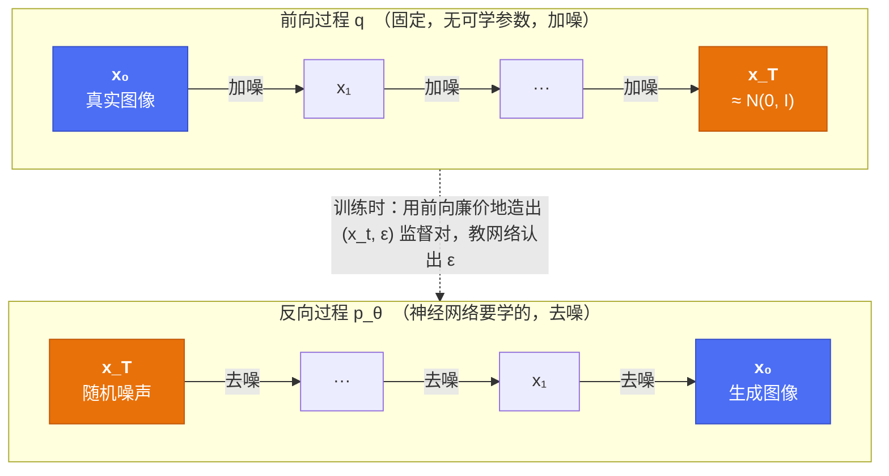

# Diffusion 基础：前向加噪、反向去噪、训练与采样

!!! abstract "这一篇要回答什么"

    - 生成模型为什么绕这么大一圈，非要"先毁掉图像再学着修复"？
    - 为什么前向过程可以**一步跳到任意时刻** \(t\)，不用真的循环加噪一千次？
    - 那个看起来朴素到不像话的损失 \(\|\boldsymbol{\epsilon}-\boldsymbol{\epsilon}_\theta\|^2\)，是怎么从 ELBO 一路化简出来的？
    - 为什么网络要预测**噪声**，而不是直接预测干净图像？

    对应论文：DDPM (Ho et al., 2020)、DDIM (Song et al., 2021)、Improved DDPM (Nichol & Dhariwal, 2021)。

## 1. 出发点：生成建模难在哪

生成建模的任务是：给定一堆样本（比如"所有自然图像"），学到它们的分布 \(p(\mathbf{x})\)，并能从中**采样**出新样本。

难点在于 \(p(\mathbf{x})\) 极其复杂。一张 \(256\times256\) 的 RGB 图像住在 20 万维空间里，而"看起来像真实照片"的那些点，只占据其中一个维度极低、形状极其扭曲的流形。要用一个神经网络一步到位地把简单分布（高斯球）映射到这个流形上，是件很难的事——前作的伤疤都在这：

| 路线 | 做法 | 硬伤 |
|---|---|---|
| **GAN** | 生成器 vs 判别器对抗 | 训练不稳定、mode collapse，覆盖不全 |
| **VAE** | 编码到隐变量再一步解码 | 样本偏糊（高斯似然 + 后验近似的双重代价）|
| **自回归** | 逐像素条件生成 | 数学干净，但生成一张图要几万次前向，太慢 |

??? note "展开：GAN 和 VAE 的硬伤，根因到底是什么（这决定了 diffusion 能躲开什么）"

    一句话先行：**GAN 的病根在"它不是最小化一个损失，而是打一场博弈"；VAE 的病根在"它用逐像素 L2 去拟合一个本质多解的问题"。** 看懂这两点，才能看懂后面 diffusion 为什么两个都能躲开。

    **▍GAN：为什么不稳定、为什么 mode collapse**

    GAN 的目标是个 minimax 博弈：\(\min_G \max_D\ \mathbb{E}_{\mathbf{x}\sim p_{\text{data}}}[\log D(\mathbf{x})] + \mathbb{E}_{\mathbf{z}}[\log(1-D(G(\mathbf{z})))]\)。

    **不稳定**：普通网络训练是最小化一个固定损失，永远朝下坡走，方向明确。GAN 要找的却是生成器 \(G\) 与判别器 \(D\) 的纳什均衡，数学上是个**鞍点**——优化 \(G\) 的同时 \(D\) 也在动，\(G\) 要爬的地形被 \(D\) 每一步重新塑形，反之亦然。梯度下降-上升在鞍点附近极易**震荡甚至发散**，像石头剪刀布一样打转，不收敛。

    更深一层（Arjovsky 2017）：自然图像落在高维空间的一个低维流形上，真实分布与生成分布的流形**几乎必然不重叠**。此时一个足够强的 \(D\) 能把两者完美分开，而在它饱和处（自信输出 0 或 1）传给 \(G\) 的梯度**趋近于零**。用散度的语言说：最优 \(D\) 下 GAN 在最小化两分布的 JS 散度，而两者不重叠时 JS 恒为常数 \(\log 2\)，梯度处处为零——\(G\) 收不到"往哪挪"的有效信号。于是陷入刀刃上的两难：\(D\) 太弱指导不了 \(G\)，太强又让 \(G\) 梯度消失，要人工把两者强弱精确平衡住。这就是 GAN 难训的本质。（Wasserstein GAN 换用 Earth-Mover 距离，正是为了让不重叠时仍有平滑梯度。）

    **mode collapse**：\(G\) 的唯一任务是骗过 \(D\)。只要它找到几张能稳定骗过 \(D\) 的输出，就**没有任何动力去覆盖数据的全部多样性**——损失里根本没有一项在惩罚"你漏掉了某个模式"。对照之下，基于似然的方法（VAE、diffusion、自回归）大致在最小化 \(\mathrm{KL}(p_{\text{data}}\,\|\,p_{\text{model}})\)，这是**覆盖型（mode-covering）**的：凡真实数据有、而模型概率为零处，KL 会爆成无穷，逼模型覆盖所有模式。**似然=覆盖，对抗=寻峰**，这就是 mode collapse 的根。

    **▍VAE：为什么样本糊**

    VAE 的 decoder \(p_\theta(\mathbf{x}\mid\mathbf{z})\) 通常建成一个固定方差的高斯，于是 \(\log p_\theta(\mathbf{x}\mid\mathbf{z}) \propto -\|\mathbf{x}-\text{decoder}(\mathbf{z})\|^2\)——最大化它就是**最小化逐像素 L2**。

    关键在这：给定一个 \(\mathbf{z}\)，合理的 \(\mathbf{x}\) 往往**不止一张**（边缘、纹理的精确位置本就有歧义，是一对多映射）。而 L2 在目标多峰时，最优解是所有合理输出的**条件均值**；把若干张各自清晰、位置略错位的图平均起来，得到的就是一张糊图。逐像素高斯无法表达"边缘要么在这、要么在那"这种多峰，它只会**折中**——这是 VAE 糊的根本原因。

    次因是**后验近似的 gap**：真实后验 \(p(\mathbf{z}\mid\mathbf{x})\) 很复杂，VAE 用简单的对角高斯 \(q_\phi(\mathbf{z}\mid\mathbf{x})\) 去近似它。ELBO 只是对数似然的**下界**，差额恰是 \(\mathrm{KL}(q_\phi(\mathbf{z}\mid\mathbf{x})\,\|\,p(\mathbf{z}\mid\mathbf{x}))\)，因 \(q\) 被限制在简单分布族里而不为零——你优化的是一个松的下界，拟合能力天然打了折。

    **▍于是 diffusion 的立足点**

    - **躲开 GAN 的两个病**：diffusion 基于似然（覆盖型，不 collapse），且训练是**单一的 MSE 回归**，永远朝下坡走——没有博弈、没有鞍点、没有平衡 \(D\) 强弱的刀刃。这正是它稳定性上碾压 GAN 的原因。
    - **躲开 VAE 的糊**：这里有个漂亮的对称。VAE 和 diffusion **用的是同一件工具**——高斯条件 + 逐像素 MSE，区别只在**用对没用对地方**。VAE 想**一步**从 \(\mathbf{z}\) 解码到 \(\mathbf{x}\)，而这一步的条件分布高度多峰，高斯假设严重失效 → 取均值 → 糊。diffusion 把过程拆成上千小步，每步只去掉一点点噪声，此时反向条件 \(p(\mathbf{x}_{t-1}\mid\mathbf{x}_t)\) **真的近似单峰高斯**（见第 4 节的论证），预测它的均值不会跨多张迥异的图去平均，自然不糊。**同一个高斯 MSE，VAE 用在了它失效的 regime，diffusion 用在了它成立的 regime**——这正是"为什么必须拆成很多小步"的一半意义。

??? note "再展开：为什么「最大似然 = 覆盖型」？彻底讲清前向 / 反向 KL 的不对称"

    上一块用到一句"似然=覆盖、对抗=寻峰"。这句话是理解 VAE / diffusion / GAN 分野的根，但它一点也不显然，值得单独讲透。核心只有一件事：**KL 散度是不对称的，而最大似然恰好用的是它"覆盖型"的那一侧。**

    **▍先回顾：最大似然（MLE）到底是什么**

    别急着谈"两个分布"——MLE 的定义里根本没有第二个分布，它就是**调模型参数、让你手上的观测数据最可能**。给定观测样本 \(x_1,\dots,x_N\)，我们假设一个带未知参数 \(\theta\) 的分布 \(q_\theta\)。先把这个符号钉死：**\(q_\theta\) 就是我们对"原始数据的概率分布"的参数化估计**——真实分布 \(p\) 未知也拿不到，所以造一个带旋钮的分布来当它的替身，旋钮（\(\theta\)）拧到哪，替身就长成什么样。**似然**则是把数据看成 \(\theta\) 的函数、问"这组参数下我实际看到的数据有多可能"：

    \[
    L(\theta) = \prod_i q_\theta(x_i),\qquad \theta^* = \arg\max_\theta \sum_i \log q_\theta(x_i)
    \]

    一个要记牢的区别：同一个 \(q_\theta(x)\)，**固定 \(\theta\) 看 \(x\)** 是**概率**，**固定数据 \(x\) 看 \(\theta\)** 才是**似然**（它不是 \(\theta\) 上的分布，对 \(\theta\) 积分不为 1）。MLE 用的是后者——这正是它叫"似然估计"而非"概率估计"的原因。

    最小的例子：抛硬币 10 次得 7 正，模型是正面概率为 \(p\) 的伯努利，似然 \(L(p)=p^7(1-p)^3\)，最大化得 \(p^*=0.7\)——那个"让 7/10 正面这件事最可能发生"的 \(p\)。**全程只有数据 + 一个带旋钮的模型，没有第二个分布。**

    那"逼近真实分布"是从哪冒出来的？下面第一步就会看到：它是样本量趋于无穷时**推出来的等价结果**，不是定义。把神经网络的几百万权重看成硬币那个 \(p\)、把训练图像看成那 10 次抛掷，故事完全一样。

    **▍第一步：最大似然就是在最小化"前向 KL"**

    记真实分布为 \(p\)（数据），模型为 \(q_\theta\)。最大似然要最大化 \(\mathbb{E}_{\mathbf{x}\sim p}[\log q_\theta(\mathbf{x})]\)。而

    \[
    \mathrm{KL}(p\,\|\,q_\theta) = \mathbb{E}_{p}[\log p(\mathbf{x})] - \mathbb{E}_{p}[\log q_\theta(\mathbf{x})] = -H(p) - \mathbb{E}_{p}[\log q_\theta(\mathbf{x})]
    \]

    第一项 \(-H(p)\) 是真实分布的熵，与 \(\theta\) 无关。所以

    \[
    \max_\theta\ \mathbb{E}_{p}[\log q_\theta] \iff \min_\theta\ \mathrm{KL}(p\,\|\,q_\theta)
    \]

    **最大似然 = 最小化前向 KL**（"前向"指真实分布 \(p\) 摆在第一个位置、期望对 \(p\) 取）。这一步是后面一切的基础。

    **▍第二步：前向 KL 的不对称性 —— 为什么它"零回避 / 覆盖"**

    盯住被积函数看：\(\mathrm{KL}(p\|q) = \int p(\mathbf{x})\,\log\frac{p(\mathbf{x})}{q(\mathbf{x})}\,d\mathbf{x}\)。分两种区域：

    - **数据有、模型无**（\(p(\mathbf{x})>0\) 但 \(q(\mathbf{x})\to 0\)）：\(\log\frac{p}{q}\to+\infty\)，又被正的 \(p(\mathbf{x})\) 加权 → 积分**炸到 \(+\infty\)**。**重罚。**
    - **数据无、模型有**（\(p(\mathbf{x})=0\) 但 \(q(\mathbf{x})>0\)）：被积函数 \(=0\cdot\log(0/q)=0\) → **完全不罚**。

    一句话：前向 KL **只怕"漏"，不怕"多"**。模型必须在所有数据出现过的地方都放上概率质量（否则损失爆炸），却可以放心地把质量溢出到没有数据的空白区（免费）。这就是**零回避（zero-avoiding）= 覆盖型（mode-covering）**：宁可铺得太宽、把空谷也占上，也绝不敢丢掉任何一个数据模式。

    **▍第三步：反向 KL —— 反过来，"零强制 / 寻峰"**

    换成 \(\mathrm{KL}(q\|p) = \int q(\mathbf{x})\log\frac{q(\mathbf{x})}{p(\mathbf{x})}\,d\mathbf{x}\)（期望改对 \(q\) 取），不对称性整个翻过来：

    - **模型有、数据无**（\(q>0,\ p\to0\)）：\(\log\frac{q}{p}\to+\infty\)，被 \(q\) 加权 → 炸。**重罚** → 模型不敢在没有数据处放质量。
    - **数据有、模型无**（\(p>0,\ q=0\)）：被积函数 \(=0\) → **不罚漏掉的模式**。

    所以反向 KL **只怕"多"，不怕"漏"**：宁可缩进一个峰里、又窄又尖，也绝不把质量撒到峰与峰之间的低密度区。这是**零强制（zero-forcing）= 寻峰型（mode-seeking）**。

    **▍一张图看穿：单个高斯拟合双峰目标**

    
    

    同一个双峰目标 \(p\)（灰），用同一族（单个高斯）去拟合，两种 KL 给出截然相反的解：

    - **前向 KL（蓝，最大似然）**：最优解是**矩匹配**的宽高斯（均值 0、标准差 2.09），骑跨两峰，连中间 \(x=0\) 的空谷都放了质量——覆盖到了，但溢进了没有数据的地方。
    - **反向 KL（橙）**：锁定其中一个峰（均值 −2、标准差 0.6），又窄又尖，**另一个峰被彻底丢弃**——寻峰。

    （顺带一提：前向 KL 对指数族的最优解正是**矩匹配**，这是"覆盖型"最干净的数学写照。）

    **▍回到生成模型**

    - **VAE、diffusion、自回归** = （变分）最大似然 = 前向 KL = **覆盖型**：努力覆盖数据的全部模式，代价是可能在低密度区也放一点质量。
    - **GAN** = 对抗目标，实践中的非饱和损失与训练动态**偏向寻峰**（严格说，最优判别器下 GAN 最小化的是 JS 散度、并非干净的反向 KL，这里只取其"寻峰"的行为倾向，不做等号）。所以 GAN 样本常常**又清晰又不全**——这正是 mode collapse。

    **▍关键澄清：覆盖型 ≠ 糊**

    很容易误读成"覆盖型 → 糊"，但这是两件事，务必分开：

    - **覆盖**说的是**哪些峰被表示**（全都表示 vs 只挑一个）——**分布层面**的性质。
    - **糊**说的是**每个条件怎么被画出来**——**渲染层面**的性质，来自"用单峰高斯去拟合一个本身多峰的条件、于是被迫取均值"。

    **diffusion 和 VAE 都是覆盖型，但 diffusion 不糊、VAE 糊**，差别只在渲染层面：VAE 想一步从 \(\mathbf{z}\) 解码，那一步的条件 \(p(\mathbf{x}\mid\mathbf{z})\) 高度多峰，高斯一取均值就糊；diffusion 拆成上千小步，每步反向条件近似单峰（第 4 节），高斯取均值不跨越迥异图像，于是**既覆盖又清晰**。一句话收束：**覆盖型是好事（不丢模式），糊是另一个问题（单峰高斯用错了地方），diffusion 恰好只要前者、避开后者。**

    **▍最后一块拼图：\(q_\theta(\mathbf{x})\) 能不能算出来，决定了各家怎么训**

    上面默认 MLE 可以照定义执行，但那有个前提：你得能对任意一个样本 \(\mathbf{x}\) **求出 \(q_\theta(\mathbf{x})\) 的数值**。能不能求，把生成模型分成了三档：

    - **显式可算**（伯努利、高斯、自回归）：\(q_\theta(\mathbf{x})\) 有显式公式，直接照定义 \(\max_\theta\sum_i\log q_\theta(x_i)\) 训练。自回归把 \(q_\theta(\mathbf{x})\) 拆成 \(\prod_i q_\theta(x_i\mid x_{<i})\)、每个因子都可算——第 1 节表格里说它"数学干净"，指的就是这个：**精确似然**。
    - **算不动，但够得着下界**（VAE、diffusion）：\(q_\theta(\mathbf{x})\) 要对全部隐变量积分，intractable。于是退而优化它的**变分下界（ELBO）**——第 5 节那整套推导不是故弄玄虚，正是因为真实的 \(\log q_\theta(\mathbf{x})\) 求不出来，只能优化一个够得着的下界。
    - **完全没有密度**（GAN）：只能从模型**采样**（噪声进、图像出），却问不出"这张图的密度是多少"——所谓**隐式模型（implicit model）**。没有似然可最大化，只能另起炉灶走对抗训练；也因此脱离了"似然=覆盖"的保护伞，mode collapse 由此埋下。

    一句话：**MLE 是理想，能不能照做取决于 \(q_\theta\) 的密度可不可求——可求就直接 MLE（自回归），求不动就优化下界（VAE / diffusion），根本没有密度就对抗（GAN）。**

## 2. 核心 insight：把一个难问题拆成一千个简单问题

Diffusion 的想法可以用一句话概括：

!!! quote "核心 insight"

    与其学"一步从噪声跳到图像"（太难），不如学"很多步、每步只去掉一点点噪声"（每步都简单到几乎是线性的）。

这个拆解之所以成立，靠的是一个关键的不对称性：

- **把图像毁掉是容易的**——往上加高斯噪声就行，完全不需要学习，甚至有解析解。
- **把图像修复是困难的**——但如果每一步只毁掉了"一点点"，那么修复这一点点，就是个简单到可以被神经网络轻松拟合的任务。

于是我们造一条链：前向一路加噪把图像碾成纯噪声（**固定、无参数**），反向一路去噪把纯噪声还原成图像（**这才是要学的**）。



采样时我们只用反向链；前向链的唯一作用，是在训练期**廉价地伪造出无穷多的训练数据**——任取一张真图、任取一个 \(t\)、任取一个噪声，就得到一组 \((\mathbf{x}_t, \boldsymbol{\epsilon})\) 监督对。

## 3. 前向过程：加噪，以及那个关键的闭式解

### 3.1 定义

每一步往图像里掺一点高斯噪声，同时把原信号按比例缩小一点：

\[
q(\mathbf{x}_t \mid \mathbf{x}_{t-1}) = \mathcal{N}\!\left(\mathbf{x}_t;\ \sqrt{1-\beta_t}\,\mathbf{x}_{t-1},\ \beta_t \mathbf{I}\right)
\]

其中 \(\{\beta_t\}_{t=1}^T\) 是预先设定的 **noise schedule**，\(\beta_t \in (0,1)\) 且通常随 \(t\) 递增。DDPM 原文取 \(T=1000\)，\(\beta_t\) 从 \(10^{-4}\) 线性升到 \(0.02\)。

写成采样形式更直观（重参数化）：

\[
\mathbf{x}_t = \sqrt{1-\beta_t}\,\mathbf{x}_{t-1} + \sqrt{\beta_t}\,\boldsymbol{\epsilon},\qquad \boldsymbol{\epsilon}\sim\mathcal{N}(\mathbf{0},\mathbf{I})
\]

!!! question "为什么缩放系数偏偏是 \(\sqrt{1-\beta_t}\)？"

    为了**保持方差**。假设 \(\mathrm{Var}(\mathbf{x}_{t-1}) = 1\)（数据已归一化），那么

    \[
    \mathrm{Var}(\mathbf{x}_t) = (1-\beta_t)\cdot 1 + \beta_t = 1
    \]

    信号被压缩多少，就正好补进多少噪声，总能量守恒。这类 schedule 因此被称为 **variance preserving (VP)**。若不做这个缩放，随着 \(t\) 增大方差会一路膨胀到爆炸，网络需要处理的数值尺度在不同 \(t\) 之间差几个数量级，根本没法训练。

### 3.2 闭式解：一步跳到任意时刻 t

如果每次采样 \(\mathbf{x}_t\) 都要老老实实循环 \(t\) 次，训练会慢到不可用。幸好高斯的叠加有解析解。记

\[
\alpha_t := 1-\beta_t, \qquad \bar\alpha_t := \prod_{s=1}^{t}\alpha_s
\]

展开两步看看：

\[
\begin{aligned}
\mathbf{x}_t &= \sqrt{\alpha_t}\,\mathbf{x}_{t-1} + \sqrt{1-\alpha_t}\,\boldsymbol{\epsilon}_{t-1}\\
&= \sqrt{\alpha_t}\left(\sqrt{\alpha_{t-1}}\,\mathbf{x}_{t-2} + \sqrt{1-\alpha_{t-1}}\,\boldsymbol{\epsilon}_{t-2}\right) + \sqrt{1-\alpha_t}\,\boldsymbol{\epsilon}_{t-1}\\
&= \sqrt{\alpha_t\alpha_{t-1}}\,\mathbf{x}_{t-2} + \underbrace{\sqrt{\alpha_t(1-\alpha_{t-1})}\,\boldsymbol{\epsilon}_{t-2} + \sqrt{1-\alpha_t}\,\boldsymbol{\epsilon}_{t-1}}_{\text{两个独立高斯之和}}
\end{aligned}
\]

关键的一步：两个独立零均值高斯相加，结果仍是高斯，方差直接相加：

\[
\alpha_t(1-\alpha_{t-1}) + (1-\alpha_t) = 1 - \alpha_t\alpha_{t-1}
\]

所以那一大坨等价于单个 \(\sqrt{1-\alpha_t\alpha_{t-1}}\,\bar{\boldsymbol{\epsilon}}\)。归纳下去即得**本篇最重要的公式**：

\[
\boxed{\ \mathbf{x}_t = \sqrt{\bar\alpha_t}\,\mathbf{x}_0 + \sqrt{1-\bar\alpha_t}\,\boldsymbol{\epsilon},\qquad \boldsymbol{\epsilon}\sim\mathcal{N}(\mathbf{0},\mathbf{I})\ }
\]

即 \(q(\mathbf{x}_t\mid\mathbf{x}_0) = \mathcal{N}(\mathbf{x}_t;\sqrt{\bar\alpha_t}\mathbf{x}_0,\ (1-\bar\alpha_t)\mathbf{I})\)。

这个式子的意义怎么强调都不过分：

- **训练可以随机取 \(t\)**，一次前向就构造出样本，无需循环 —— 这是 diffusion 能训得动的前提。
- \(\sqrt{\bar\alpha_t}\) 就是**信号残留的比例**，\(\sqrt{1-\bar\alpha_t}\) 是**噪声占比**，两者平方和恒为 1。整个前向过程被压缩成了一个"信号与噪声此消彼长"的插值。
- \(\bar\alpha_t\) 单调递减；当 \(\bar\alpha_T \approx 0\) 时 \(\mathbf{x}_T\approx\mathcal{N}(\mathbf{0},\mathbf{I})\)，与 \(\mathbf{x}_0\) 无关 —— 这正是采样时能从纯噪声起步的依据。

### 3.3 Noise schedule：信号该以什么节奏衰减

既然一切由 \(\bar\alpha_t\) 决定，它的形状就是个设计选择。DDPM 的线性 schedule 有个后来被发现的毛病：


/// caption
左：信号残留比例 \(\bar\alpha_t\) 的衰减。右：对数信噪比 \(\log\mathrm{SNR}_t = \log\frac{\bar\alpha_t}{1-\bar\alpha_t}\)。
///

线性 schedule（橙）在 \(t\approx 259\) 就已经丢掉一半信号，到后半程 \(\bar\alpha_t\) 早已贴地——最后 100 步的 \(\bar\alpha_t\) 平均只有 \(1.2\times10^{-4}\)，几乎是在纯噪声上空转。这些步数既没在破坏信息（早毁完了），也就没给网络提供有效的学习信号，等于白白浪费了近四分之一的采样预算。

Improved DDPM 因此改用 **cosine schedule**（蓝）：

\[
\bar\alpha_t = \frac{f(t)}{f(0)},\qquad f(t)=\cos^2\!\left(\frac{t/T+s}{1+s}\cdot\frac{\pi}{2}\right),\quad s=0.008
\]

它到 \(t\approx 496\)（差不多正中间）才丢掉一半信号，末段 \(\bar\alpha_t\) 均值 \(7.9\times10^{-3}\)，比线性高约 60 倍，信息销毁得更均匀，每一步都在干活。实现上还要把由此反推出的 \(\beta_t\) 截断在 0.999 以内，否则末步 \(\bar\alpha_T\) 会精确塌到 0 导致方差退化。

!!! tip "复现这张图"

    图由 [`scripts/gen_noise_schedule.py`](https://github.com/veogeek-no1/world_model_learning/blob/main/scripts/gen_noise_schedule.py) 生成，
    上面这些数字全部来自实际计算而非估计。改 schedule 参数后重跑 `python scripts/gen_noise_schedule.py` 即可更新。

## 4. 反向过程：为什么反向条件可以近似建模成高斯

我们想要 \(q(\mathbf{x}_{t-1}\mid\mathbf{x}_t)\)——但它需要对整个数据分布积分，无法求得。这里有个漂亮的理论结果救场：

!!! note "关键事实"

    当 \(\beta_t\) 足够小时，反向条件分布 \(q(\mathbf{x}_{t-1}\mid\mathbf{x}_t)\) **也近似是高斯**。

    这正是"必须拆成很多小步"的深层原因：步子迈大了，反向分布会变成复杂的多峰分布（从一张糊图能还原出的清晰图有很多种），高斯就拟合不了了。**\(T\) 大 \(\Leftrightarrow\) 每步 \(\beta_t\) 小 \(\Leftrightarrow\) 反向可用高斯近似**——三者是一回事。

??? note "展开：这个「关键事实」凭什么成立？三层论证，从机制到定理"

    上面是个断言，不该被无条件吞下。它有三层论证，严格程度递增：Taylor 展开讲机制，一个可精确求解的例子给硬验证，连续时间定理给严格地基。

    **▍论证一：Bayes + Taylor —— 看清"小步"到底在哪里进场**

    对反向条件用贝叶斯定理，先把公式写全：

    \[
    q(\mathbf{x}_{t-1}\mid\mathbf{x}_t)\ =\ \frac{q(\mathbf{x}_t\mid\mathbf{x}_{t-1})\ \cdot\ q(\mathbf{x}_{t-1})}{q(\mathbf{x}_t)}
    \]

    三个因子各是谁：分子第一项是**似然**——"上一步若是这张图，加一步噪声后变成现在这样的概率"，这是前向方向，我们自己定义的，明确是高斯；分子第二项是**边缘** \(q(\mathbf{x}_{t-1})\)——\(t-1\) 噪声水平上这张图本身的常见程度，复杂多峰，扮演先验的角色；分母 \(q(\mathbf{x}_t)\) 是**归一化项**。

    关键一步：**\(\mathbf{x}_t\) 是已经观测到、固定住的**，所以分母 \(q(\mathbf{x}_t)\) 不随 \(\mathbf{x}_{t-1}\) 变，只是一个常数。我们关心的是后验作为 \(\mathbf{x}_{t-1}\) 的函数长什么**形状**，常数不影响形状（最后归一化补回即可），因此把它省掉，写成正比：

    \[
    q(\mathbf{x}_{t-1}\mid\mathbf{x}_t)\ \propto\ \underbrace{q(\mathbf{x}_t\mid\mathbf{x}_{t-1})}_{\text{似然：高斯，已知}}\ \cdot\ \underbrace{q(\mathbf{x}_{t-1})}_{\text{边缘：复杂多峰}}
    \]

    **似然项**：先把它写全再取 log。前向条件（3.1 节）\(q(\mathbf{x}_t\mid\mathbf{x}_{t-1})=\mathcal{N}(\mathbf{x}_t;\sqrt{1-\beta_t}\,\mathbf{x}_{t-1},\beta_t\mathbf{I})\)，代进 \(d\) 维高斯密度 \(\mathcal{N}(\mathbf{x};\boldsymbol{\mu},\sigma^2\mathbf{I})=(2\pi\sigma^2)^{-d/2}\exp(-\|\mathbf{x}-\boldsymbol{\mu}\|^2/2\sigma^2)\)，取 log：

    \[
    \log q(\mathbf{x}_t\mid\mathbf{x}_{t-1}) = -\frac{1}{2\beta_t}\left\|\mathbf{x}_t-\sqrt{1-\beta_t}\,\mathbf{x}_{t-1}\right\|^2 \underbrace{-\ \tfrac{d}{2}\log(2\pi\beta_t)}_{\text{不含 }\mathbf{x}_{t-1}\text{，记为 }C}
    \]

    这是**精确的二次式**（无近似）。但我们要把它当 \(\mathbf{x}_{t-1}\) 的函数，得把范数整理成 \(\|\mathbf{x}_{t-1}-\text{中心}\|^2\) 的形状——从平方里提出 \(\sqrt{1-\beta_t}\)：

    \[
    \left\|\mathbf{x}_t-\sqrt{1-\beta_t}\,\mathbf{x}_{t-1}\right\|^2
    =\left\|-\sqrt{1-\beta_t}\left(\mathbf{x}_{t-1}-\tfrac{\mathbf{x}_t}{\sqrt{1-\beta_t}}\right)\right\|^2
    =(1-\beta_t)\left\|\mathbf{x}_{t-1}-\tfrac{\mathbf{x}_t}{\sqrt{1-\beta_t}}\right\|^2
    \]

    代回即得（\(1-\beta_t\) 除到 \(2\beta_t\) 上，给出那个系数）：

    \[
    \log q(\mathbf{x}_t\mid\mathbf{x}_{t-1}) = -\frac{1-\beta_t}{2\beta_t}\left\|\mathbf{x}_{t-1}-\frac{\mathbf{x}_t}{\sqrt{1-\beta_t}}\right\|^2 + C
    \]

    每个部件都有出处：系数 \(\tfrac{1-\beta_t}{2\beta_t}\) 来自"提出 \(1-\beta_t\) 再除 \(2\beta_t\)"，中心 \(\tfrac{\mathbf{x}_t}{\sqrt{1-\beta_t}}\) 来自把 \(\sqrt{1-\beta_t}\) 除到 \(\mathbf{x}_t\) 上。把它当 \(\mathbf{x}_{t-1}\) 的高斯读，方差 \(\sigma'^2\) 满足 \(\tfrac{1}{2\sigma'^2}=\tfrac{1-\beta_t}{2\beta_t}\)，即 \(\sigma'^2=\tfrac{\beta_t}{1-\beta_t}\approx\beta_t\)——所以它是一个中心在 \(\tfrac{\mathbf{x}_t}{\sqrt{1-\beta_t}}\)（\(\approx\mathbf{x}_t\)）、**宽度 \(O(\sqrt{\beta_t})\) 的极窄高斯窗**（"宽度 \(\sqrt{\beta_t}\)"就是这么反推出来的），把 \(\mathbf{x}_{t-1}\) 死死限制在 \(\mathbf{x}_t\) 周围的小球里。

    **边缘项** \(\log q(\mathbf{x}_{t-1})\) 是复杂多峰的函数，但我们**只需要它在窗内的样子**。先钉死展开的对象：Taylor **只伺候这一项**——似然项本来就是高斯，取完 log 是**精确的**二次式，不需要任何近似。展开点取 \(\mathbf{x}_t\)，展开变量 \(\boldsymbol{\delta}=\mathbf{x}_{t-1}-\mathbf{x}_t\)；注意"\(\boldsymbol{\delta}\) 小"**不是假设，是似然窗强制的**——窗外 \(\|\boldsymbol{\delta}\|\gg\sqrt{\beta_t}\) 的候选早被压到零权重，展开只需在 \(\|\boldsymbol{\delta}\|\sim\sqrt{\beta_t}\) 内有效。记 \(\mathbf{s}=\nabla\log q(\mathbf{x}_t)\)（score）、\(\mathbf{H}\) 为 Hessian：

    \[
    \log q(\mathbf{x}_{t-1}) = \log q(\mathbf{x}_t) + \mathbf{s}^\top\boldsymbol{\delta} + \tfrac{1}{2}\boldsymbol{\delta}^\top\mathbf{H}\,\boldsymbol{\delta} + O(\|\boldsymbol{\delta}\|^3)
    \]

    把 \(\|\boldsymbol{\delta}\|\sim\sqrt{\beta_t}\) 代入逐阶记账，**每降一阶小一个 \(\sqrt{\beta_t}\)**：

    | 阶数 | 量级 | 对高斯窗做了什么 |
    |---|---|---|
    | 0 阶（常数） | \(O(1)\) | 被归一化吸收，无影响 |
    | 1 阶 \(\mathbf{s}^\top\boldsymbol{\delta}\) | \(O(\sqrt{\beta_t})\) | **平移均值** \(\beta_t\mathbf{s}\)——高斯乘指数线性倾斜**仍是高斯**。score 自己冒出来了，呼应第 7 节 |
    | 2 阶 \(\tfrac12\boldsymbol{\delta}^\top\mathbf{H}\boldsymbol{\delta}\) | \(O(\beta_t)\) | **微调方差**（相对改 \(O(\beta_t)\)），指数里加二次项**仍是高斯**——\(\mathbf{H}=O(1)\)，似然窗曲率 \(1/\beta_t\) 占绝对主导 |
    | 3 阶起 | \(O(\beta_t^{3/2})\) | **真正破坏高斯性的第一项** |

    两个自然的追问，答案都在这张表里：

    - **为什么写到二阶、不在一阶就停？** 截断的合法性靠"写出第一个被扔掉的项，并证明它小"——只写到一阶就停，"凭什么可以线性化"就成了新的无凭据断言。这是摄动论证的规矩：**保到 n 阶，就要验尸 n+1 阶**。而且表里还藏着一个更强的事实：二阶即使不扔，结果**仍是高斯**（只是方差微调）；真正的非高斯性从三阶才开始——所以"近似高斯"这个结论，比"线性化"听起来的更稳固。
    - **一阶和二阶都趋于零，凭什么保一扔二？** 看**累积**：采样要走 \(T\approx 1/\beta_t\) 步。一阶是**信号**——每步沿 score 平移 \(\beta_t\mathbf{s}\)，方向相干，累积 \(T\cdot\beta_t=O(1)\)，正是把纯噪声搬回数据分布的全部总位移，扔了它采样哪儿也去不了。二阶以上是**误差**——方差误差累积 \(T\cdot\beta_t^{2}=O(\beta_t)\to0\)，非高斯量累积 \(T\cdot\beta_t^{3/2}=O(\sqrt{\beta_t})\to0\)，把全部步数加完仍然消失。**保一扔二不是双标，是累积之后谁活谁死。**（这套记账与中心极限定理同一精神：许多小步叠加，高斯部分留下，非高斯修正被 \(\sqrt{\beta_t}\) 压掉。）

    于是（\(q_{t-1}\) 与 \(q_t\) 之差同为 \(O(\beta_t)\)，并入误差项）：

    \[
    q(\mathbf{x}_{t-1}\mid\mathbf{x}_t)\ \approx\ \mathcal{N}\!\left(\frac{\mathbf{x}_t}{\sqrt{1-\beta_t}}+\beta_t\nabla\log q(\mathbf{x}_t),\ \ \beta_t\mathbf{I}\right)
    \]

    **"小步"在哪进场，一目了然**：整个论证靠"在 \(O(\sqrt{\beta_t})\) 宽的窗内 \(\log q\) 可以线性化"。步子一大，窗变宽，窗内装进边缘分布的多个峰，线性化失效 → 后验真的变多峰。"一张糊图能还原出很多种清晰图"，说的就是窗太宽、窗里有好几个互不相干的原像。

    **▍论证二：一个可精确求解的例子 —— 双点数据，亲手验证**

    取最极端的数据分布：只有两个点，\(p_{\text{data}}=\tfrac12\delta_{-1}+\tfrac12\delta_{+1}\)。此时反向条件可以**精确算出**（就用本节下文的后验公式 \(\tilde\mu_t,\tilde\beta_t\)，对两个可能的 \(\mathbf{x}_0\) 加权）：

    \[
    q(x_{t-1}\mid x_t)=\sum_{k=\pm1} w_k(x_t)\,\mathcal{N}\!\big(\tilde\mu_t(x_t,k),\ \tilde\beta_t\big),\qquad w_k\propto\tfrac12\,\mathcal{N}\!\big(x_t;\ \sqrt{\bar\alpha_t}\,k,\ 1-\bar\alpha_t\big)
    \]

    它**天生是两个高斯的混合**——严格说就是多峰的！但看"分量间距 / 分量宽度"这个比值：\(\tilde\mu_t\) 里 \(x_0\) 的系数是 \(\sqrt{\bar\alpha_{t-1}}\beta_t/(1-\bar\alpha_t)\)，所以**间距 \(=O(\beta_t)\)**；而分量宽度 \(\sqrt{\tilde\beta_t}=O(\sqrt{\beta_t})\)。比值 \(=O(\sqrt{\beta_t})\to 0\)：**间距塌缩得比宽度快，两峰融成一个高斯**。这就是"近似高斯"的精确含义。实算一遍（固定噪声水平 \(\bar\alpha_t=0.5\)、固定观测 \(x_t\)，只改单步大小）：

    
    

    - \(\beta_t=0.02\)：间距/宽度 \(=0.41\)，精确分布与单高斯拟合的 \(\mathrm{KL}=1.0\times10^{-6}\)——**肉眼与数值上都无法区分**。
    - \(\beta_t=0.4\)：间距/宽度 \(=4.0\)，\(\mathrm{KL}=0.17\)——差了**约 17 万倍**，明显双峰，单高斯拟合失效。

    反过来推到极限也成立：**一步到位**（\(\bar\alpha_{t-1}=1\)）时公式给出分量宽度 \(\to 0\)、均值正好落在 \(\pm1\)——后验变成**两根尖刺**，最极端的多峰。"步大 → 多峰"从直觉变成了精确结论。（图与数字由 [`scripts/gen_reverse_gaussian.py`](https://github.com/veogeek-no1/world_model_learning/blob/main/scripts/gen_reverse_gaussian.py) 实算生成。）

    **▍论证三：连续时间的严格定理（Anderson 1982）**

    把前向过程看成 SDE \(\mathrm{d}\mathbf{x}=f\,\mathrm{d}t+g\,\mathrm{d}\mathbf{w}\) 的离散化，则有经典的**时间反演定理**：扩散 SDE 的时间反演**仍是扩散 SDE**——

    \[
    \mathrm{d}\mathbf{x}=\big[f(\mathbf{x},t)-g^2(t)\,\nabla_\mathbf{x}\log q_t(\mathbf{x})\big]\mathrm{d}t+g(t)\,\mathrm{d}\bar{\mathbf{w}}
    \]

    而扩散 SDE 的无穷小转移**由构造就是高斯**（漂移 \(\cdot\,\mathrm{d}t\) + 高斯噪声 \(\cdot\sqrt{\mathrm{d}t}\)）。所以"小步下反向条件近似高斯"的严格版本就是：**反向过程本身也是一个扩散过程**。DDPM 的祖先采样正是这条反向 SDE 的 Euler–Maruyama 离散化——论证一推出的均值与定理的漂移逐项对得上。这条识别由 Score SDE (Song et al. 2021) 挑明；更早的出处链是 Sohl-Dickstein 2015 引 Feller (1949) 对离散情形的论证。诚实标注：Anderson 定理本身的证明需要平滑性/可积性等技术条件，超出本笔记范围。

    三层其实是一件事的三个面：**Taylor 讲机制、双点例子给硬验证、Anderson 给严格地基**——且三者都把 score \(\nabla\log q\) 顶到台面上，与第 7 节严丝合缝。

于是用神经网络参数化一个高斯：

\[
p_\theta(\mathbf{x}_{t-1}\mid\mathbf{x}_t) = \mathcal{N}\!\left(\mathbf{x}_{t-1};\ \boldsymbol{\mu}_\theta(\mathbf{x}_t,t),\ \sigma_t^2\mathbf{I}\right)
\]

虽然 \(q(\mathbf{x}_{t-1}\mid\mathbf{x}_t)\) 求不出，但**多给一个条件 \(\mathbf{x}_0\)，后验就有解析解**（贝叶斯 + 配方即可推出）：

\[
q(\mathbf{x}_{t-1}\mid\mathbf{x}_t,\mathbf{x}_0) = \mathcal{N}\!\left(\mathbf{x}_{t-1};\ \tilde{\boldsymbol{\mu}}_t(\mathbf{x}_t,\mathbf{x}_0),\ \tilde\beta_t\mathbf{I}\right)
\]

\[
\tilde{\boldsymbol{\mu}}_t(\mathbf{x}_t,\mathbf{x}_0) = \frac{\sqrt{\bar\alpha_{t-1}}\,\beta_t}{1-\bar\alpha_t}\mathbf{x}_0 + \frac{\sqrt{\alpha_t}\,(1-\bar\alpha_{t-1})}{1-\bar\alpha_t}\mathbf{x}_t,
\qquad
\tilde\beta_t = \frac{1-\bar\alpha_{t-1}}{1-\bar\alpha_t}\beta_t
\]

训练时 \(\mathbf{x}_0\) 是已知的（就是那张真图），所以这个后验可以当作**监督目标**。这就是整个训练目标的支点。

!!! warning "厘清：本节其实用了**两个不同**的高斯事实，别混"

    本节先说"反向条件近似是高斯"（关键事实），转头又说"带 \(\mathbf{x}_0\) 就有解析高斯"——这是**两个不同的分布、精确程度不同、用途也不同**。一张公式把它们串起来：无 \(\mathbf{x}_0\) 的真反向，其实是带 \(\mathbf{x}_0\) 后验的**混合**——

    \[
    \underbrace{q(\mathbf{x}_{t-1}\mid\mathbf{x}_t)}_{\text{无 }\mathbf{x}_0\text{，真反向}}=\int \underbrace{q(\mathbf{x}_{t-1}\mid\mathbf{x}_t,\mathbf{x}_0)}_{\text{每个都是精确高斯}}\,\underbrace{q(\mathbf{x}_0\mid\mathbf{x}_t)}_{\text{"}\mathbf{x}_t\text{ 可能来自哪个 }\mathbf{x}_0\text{"}}\,\mathrm{d}\mathbf{x}_0
    \]

    于是三种分布的身份一目了然：

    - **带 \(\mathbf{x}_0\)**（教师）\(q(\mathbf{x}_{t-1}\mid\mathbf{x}_t,\mathbf{x}_0)\)：从混合里**挑出单独一个分量** → **精确高斯，任意 \(\beta_t\) 都成立**（上面刚推的闭式解）。
    - **不带 \(\mathbf{x}_0\)**（真反向）\(q(\mathbf{x}_{t-1}\mid\mathbf{x}_t)\)：**整个混合**摆在那 → 一堆高斯叠加，**精确地看不是高斯**（一般多峰）；但 \(\beta_t\) 小时各分量的均值挤在 \(O(\beta_t)\) 内（论证二算过），混合塌成一个 → **近似高斯**。这才是"关键事实"的准确含义：**不是"就是高斯"，而是"小步下近似高斯"**。

    两个事实各管一头，别张冠李戴：

    | 事实 | 说的是哪个分布 | 用在哪个阶段 |
    |---|---|---|
    | 关键事实（无 \(\mathbf{x}_0\) **近似**高斯） | 真反向 \(q(\mathbf{x}_{t-1}\mid\mathbf{x}_t)\) | **采样**：没有 \(\mathbf{x}_0\)，拿 \(p_\theta\) 近似真反向——真反向近似高斯，高斯 \(p_\theta\) 才**够格**建模它 |
    | 闭式后验（带 \(\mathbf{x}_0\) **精确**高斯） | 后验 \(q(\mathbf{x}_{t-1}\mid\mathbf{x}_t,\mathbf{x}_0)\) | **训练**：有 \(\mathbf{x}_0\)，拿它当**可算的**监督目标（教师） |

    所以标题问的"反向条件可以近似建模成高斯"，主语是**无 \(\mathbf{x}_0\) 的真反向**，答案是"小 \(\beta_t\) 下近似成立"；而训练里那个精确高斯的教师，是**另一个**分布（带 \(\mathbf{x}_0\)）。

## 5. 训练目标：从 ELBO 到一行 MSE

### 5.1 变分上界

和 VAE 同款套路，对负对数似然取变分上界：

\[
\mathbb{E}\left[-\log p_\theta(\mathbf{x}_0)\right] \le \mathbb{E}_q\left[-\log\frac{p_\theta(\mathbf{x}_{0:T})}{q(\mathbf{x}_{1:T}\mid\mathbf{x}_0)}\right] =: L
\]

??? note "展开：为什么是「负对数似然」、又为什么「求期望」？——从最大似然到一个能 descend 的损失"

    上式左边的 \(\mathbb{E}[-\log p_\theta(\mathbf{x}_0)]\) 不是凭空写的，它是"最大化似然"这句话经过**三步无痛改写**的结果——每步都不改变最优解，只把它换成更好优化的形式。

    **▍第一步：取 log（乘积 → 求和）**

    最大似然要最大化整个数据集的似然 \(\prod_i p_\theta(\mathbf{x}_i)\)。取 log——log 单调递增，\(\arg\max\) 丝毫不变，但连乘变连加：\(\log\prod_i p_\theta(\mathbf{x}_i)=\sum_i\log p_\theta(\mathbf{x}_i)\)。为什么非换不可：

    - **数值**：几十万维图像的密度是极小的数，几万张连乘会直接下溢成 0（梯度也跟着变 0，训练瘫掉）；log 变加法就稳了。
    - **优化**：SGD 要的是能拆成 minibatch 的可加目标——\(\sum_i\) 天然可加，且 \(\nabla\sum=\sum\nabla\)，一个 batch 就能估计整体梯度。

    **▍第二步：取负（最大 → 最小）**

    优化器的惯例是**最小化**（梯度下降往下走）。\(\max\sum\log p_\theta\iff\min\sum(-\log p_\theta)\)，纯符号翻转。而 \(-\log p_\theta(\mathbf{x})\) 有个名字叫**自信息 / "surprise"**：模型给某张真图打的概率越低，\(-\log\) 越大。所以最小化负对数似然 = **让训练数据在模型眼里最不意外**（信息论上，\(-\log p(\mathbf{x})\) 是用模型 \(p\) 编码 \(\mathbf{x}\) 所需的 nat 数，最小化即最短编码）。

    **▍第三步：求期望（从"这批数据" → "数据分布"）**

    \(\frac1N\sum_i\big(-\log p_\theta(\mathbf{x}_i)\big)\) 就是训练集上的**平均**负对数似然，即经验期望 \(\mathbb{E}_{\mathbf{x}\sim\text{data}}[-\log p_\theta(\mathbf{x})]\)。除以 \(N\) 不改 \(\arg\min\)，但让损失尺度与数据量、batch 大小无关。而 \(N\to\infty\) 时它收敛到真实期望 \(\mathbb{E}_{p_{\text{data}}}[-\log p_\theta]\)——这一步正是前面"最大似然 = 覆盖型"折叠块的入口：\(\min\mathbb{E}_{p_{\text{data}}}[-\log p_\theta]\iff\min\mathrm{KL}(p_{\text{data}}\,\|\,p_\theta)\)。

    三步合起来，"最大化似然"就成了上式左边的 \(\mathbb{E}[-\log p_\theta(\mathbf{x}_0)]\)——一个**可 descend、可 minibatch、有信息论意义**的损失。剩下唯一的问题是它**算不动**（\(p_\theta(\mathbf{x}_0)\) 要积掉整条轨迹，见"最后一块拼图"），所以才用 Jensen 把它上界成 \(L\)——那是下一个折叠块的事。注意区分**两个期望**：这里的 \(\mathbb{E}\) 是对**数据**取的（平均 NLL），\(L\) 里那个 \(\mathbb{E}_q\) 是对**前向轨迹**取的（来自变分上界），两者不是一回事。

经过整理（关键是把联合分布按马尔可夫链拆开，并把 \(q(\mathbf{x}_{t-1}|\mathbf{x}_t)\) 用带 \(\mathbf{x}_0\) 的后验替换），\(L\) 可以分解成逐项的 KL：

\[
L = \underbrace{D_{\mathrm{KL}}\!\left(q(\mathbf{x}_T|\mathbf{x}_0)\,\|\,p(\mathbf{x}_T)\right)}_{L_T:\ \text{无可学参数，常数}}
+ \sum_{t=2}^{T}\underbrace{D_{\mathrm{KL}}\!\left(q(\mathbf{x}_{t-1}|\mathbf{x}_t,\mathbf{x}_0)\,\|\,p_\theta(\mathbf{x}_{t-1}|\mathbf{x}_t)\right)}_{L_{t-1}:\ \text{主项}}
\underbrace{-\log p_\theta(\mathbf{x}_0|\mathbf{x}_1)}_{L_0:\ \text{重建项}}
\]

??? note "展开：这两行是怎么来的？——从积分困境到逐项 KL，全程只有一个不等号"

    **▍第零步：困难是什么**

    模型定义的是整条反向链的联合分布 \(p_\theta(\mathbf{x}_{0:T})=p(\mathbf{x}_T)\prod_{t=1}^T p_\theta(\mathbf{x}_{t-1}|\mathbf{x}_t)\)。要拿到单独的 \(p_\theta(\mathbf{x}_0)\)，得把整条轨迹积分掉：

    \[
    p_\theta(\mathbf{x}_0)=\int p_\theta(\mathbf{x}_{0:T})\,\mathrm{d}\mathbf{x}_{1:T}
    \]

    这是 \(T\times\)图像维度重的积分（1000 步 × 几十万维），绝无可能算出。这正是第 1 节"最后一块拼图"的分类在现场发生：**密度算不动 → 退而求下界**——下面就来造这个下界。

    **▍第一步：乘除同一个 \(q\)——把积分变成期望**

    这一步不是灵光一现，而是"遇到算不动的积分"的**标准逃生通道**。跟着动机走，它几乎是被逼出来的：

    *为什么想到"变成期望"？* 高维积分没法解析算、也没法格点算（几十万维，每维切 10 格就是 \(10^{\text{几十万}}\) 个格点）。唯一不怕维度的办法是 **Monte Carlo**：只要能把积分写成"某个分布下的期望"，就能靠**采样求平均**来估计，精度只跟样本数有关、与维度无关。所以目标立刻明确——**把这个积分改写成一个"我能采样的分布"下的期望**。

    *为什么偏偏是"乘除 \(q\)"？* 期望的定义是 \(\mathbb{E}_{x\sim g}[\varphi]=\int\varphi(x)\,g(x)\,\mathrm{d}x\)——积分号里**必须贴着一个能采样的密度 \(g\)**，才能读成"对 \(g\) 采样再平均"。可现在被积函数 \(p_\theta(\mathbf{x}_{0:T})\) 里没有这样一个密度（它对 \(\mathbf{x}_{1:T}\) 既不归一、也没法采样）。那就**塞一个进去**：乘上、同时除以一个能采样的分布，净效果是乘以 1（**恒等变形**）。于是在积分里同乘同除前向过程 \(q(\mathbf{x}_{1:T}|\mathbf{x}_0)\)：

    \[
    \log p_\theta(\mathbf{x}_0)=\log\!\int q(\mathbf{x}_{1:T}|\mathbf{x}_0)\,\frac{p_\theta(\mathbf{x}_{0:T})}{q(\mathbf{x}_{1:T}|\mathbf{x}_0)}\,\mathrm{d}\mathbf{x}_{1:T}
    =\log\,\mathbb{E}_{q(\mathbf{x}_{1:T}|\mathbf{x}_0)}\!\left[\frac{p_\theta(\mathbf{x}_{0:T})}{q(\mathbf{x}_{1:T}|\mathbf{x}_0)}\right]
    \]

    *为什么 \(g\) 只能是 \(q\)？* 因为它要同时满足两条：**能采样**（放进期望）+ **密度可算**（放进分母）。前向加噪两条全占——采样就是"从 \(\mathbf{x}_0\) 一步步加高斯噪声"，密度是一串已知高斯之积。整个 setup 里它几乎是唯一的选择。这套"乘除一个能采样的分布、把积分变期望"的操作有个正式名字：**importance sampling（重要性采样）**；\(p_\theta/q\) 就是**重要性权重**——从"方便但不对"的 \(q\) 采样，再用权重纠正回真正想要的分布。

    *"对前向链积分"为何就是"对前向轨迹采样求平均"？* 这就是期望定义的两副面孔。"从 \(q(\mathbf{x}_{1:T}|\mathbf{x}_0)\) 抽一个样本"，意思是 \(\mathbf{x}_1\sim q(\mathbf{x}_1|\mathbf{x}_0)\to\mathbf{x}_2\sim q(\mathbf{x}_2|\mathbf{x}_1)\to\cdots\)——**就是把前向加噪跑一遍**，得到一条轨迹。所以 \(\int(\cdot)\,q(\mathbf{x}_{1:T}|\mathbf{x}_0)\,\mathrm{d}\mathbf{x}_{1:T}\)（对链的变量积分、以链的密度加权）\(=\) 对"跑一遍前向得到的轨迹"求平均。马尔可夫结构 \(q=\prod q(\mathbf{x}_t|\mathbf{x}_{t-1})\) 让抽一条轨迹只需 T 步、每步只加一点高斯噪声，便宜到极点。

    *这一换救了什么？* 原积分要"遍历**所有**轨迹、按 \(p_\theta\) 加权"（做不到——从 \(p_\theta\) 采样轨迹得跑整个还没训好的反向过程）；换成 \(\mathbb{E}_q[p_\theta/q]\) 后，变成"从 \(q\) 抽几条轨迹、平均 \(p_\theta/q\)"。**"遍历所有轨迹"被换成了"采样几条轨迹"**，训练里每步甚至只用一条（借闭式解连轨迹都省了，直接抽一个 \(\mathbf{x}_t\)），单样本噪声交给 SGD 平掉。

    **▍第二步：Jensen 不等式（全程唯一的不等号）**

    现在卡在 log 套在期望**外面**：\(\log\mathbb{E}_q[\cdot]\)。这为什么还不够、非再走一步不可？因为 log 是非线性的，**"log 的期望"没法用单样本无偏估计**——单条轨迹能无偏估计里面那个期望 \(\mathbb{E}_q[p_\theta/q]\)，但外面套一个 log 就有偏了（"先平均再 log" ≠ "先 log 再平均"），要估准得先抽很多条轨迹。我们想要的是能**逐样本采样**的目标，所以要把 log 挪到期望**里面**去。Jensen 不等式正好做这件事：对凹函数（log 的曲线向下弯）有 \(\log\mathbb{E}[Y]\ge\mathbb{E}[\log Y]\)。数字感受：\(Y\) 以各半概率取 1 或 100，左边 \(\log 50.5\approx 3.92\)，右边 \((\log 1+\log 100)/2\approx 2.30\)——"平均后取 log" ≥ "取 log 后平均"，因为 log 压缩大值。应用之：

    \[
    \log p_\theta(\mathbf{x}_0)\ \ge\ \mathbb{E}_q\!\left[\log\frac{p_\theta(\mathbf{x}_{0:T})}{q(\mathbf{x}_{1:T}|\mathbf{x}_0)}\right]=:\mathrm{ELBO}
    \]

    两边取负（不等号翻转），就得到正文那行变分上界 \(L\)。两句补充：**"变分"**指这个界对任意辅助分布 \(q\) 都成立、原则上可在分布空间里变动 \(q\) 调松紧——VAE 真的去学 \(q\)（encoder），而 diffusion **把 \(q\) 固定为前向加噪，不学**，省了一整个网络；且这个界不是拍脑袋的——可以证明**松紧差恰为 \(D_{\mathrm{KL}}(q(\mathbf{x}_{1:T}|\mathbf{x}_0)\,\|\,p_\theta(\mathbf{x}_{1:T}|\mathbf{x}_0))\)**，\(q\) 越接近模型真实后验，界越紧。

    **▍第三步：代入两条马尔可夫链的因子分解**

    \[
    q(\mathbf{x}_{1:T}|\mathbf{x}_0)=\prod_{t=1}^{T}q(\mathbf{x}_t|\mathbf{x}_{t-1}),\qquad
    p_\theta(\mathbf{x}_{0:T})=p(\mathbf{x}_T)\prod_{t=1}^{T}p_\theta(\mathbf{x}_{t-1}|\mathbf{x}_t)
    \]

    \[
    L=\mathbb{E}_q\!\left[-\log p(\mathbf{x}_T)-\sum_{t=1}^{T}\log p_\theta(\mathbf{x}_{t-1}|\mathbf{x}_t)+\sum_{t=1}^{T}\log q(\mathbf{x}_t|\mathbf{x}_{t-1})\right]
    \]

    **▍第四步：发现方向不匹配——借 \(\mathbf{x}_0\) 翻转 \(q\)**

    想逐项配成 KL，需要**同方向的一对分布**，但 \(p_\theta(\mathbf{x}_{t-1}|\mathbf{x}_t)\) 往回走、\(q(\mathbf{x}_t|\mathbf{x}_{t-1})\) 往前走，配不上。直接翻转成 \(q(\mathbf{x}_{t-1}|\mathbf{x}_t)\) 不行——第 4 节说过它 intractable；但第 4 节同时给了钥匙：**多条件一个 \(\mathbf{x}_0\)，反向后验就有闭式解**。于是（对 \(t\ge2\)）：

    \[
    q(\mathbf{x}_t|\mathbf{x}_{t-1})\overset{\text{马尔可夫}}{=}q(\mathbf{x}_t|\mathbf{x}_{t-1},\mathbf{x}_0)
    \overset{\text{贝叶斯}}{=}\frac{q(\mathbf{x}_{t-1}|\mathbf{x}_t,\mathbf{x}_0)\;q(\mathbf{x}_t|\mathbf{x}_0)}{q(\mathbf{x}_{t-1}|\mathbf{x}_0)}
    \]

    第一个等号值得停一下：前向加噪只看上一步，已知 \(\mathbf{x}_{t-1}\) 后再告诉它 \(\mathbf{x}_0\) 不改变分布——这让我们能"免费"塞进 \(\mathbf{x}_0\) 这个条件；第二个等号就是熟悉的贝叶斯，只是每项都带着 \(\mid\mathbf{x}_0\)。

    **▍第五步：望远镜相消（最漂亮的一步）**

    对 \(t=2\ldots T\) 应用上式（\(t=1\) 的 \(\log q(\mathbf{x}_1|\mathbf{x}_0)\) 单独留着），前向链的和变成三部分，其中比值项**写开看**：

    \[
    \sum_{t=2}^{T}\log\frac{q(\mathbf{x}_t|\mathbf{x}_0)}{q(\mathbf{x}_{t-1}|\mathbf{x}_0)}
    =\big[\log q(\mathbf{x}_2|\mathbf{x}_0)-\log q(\mathbf{x}_1|\mathbf{x}_0)\big]+\cdots+\big[\log q(\mathbf{x}_T|\mathbf{x}_0)-\log q(\mathbf{x}_{T-1}|\mathbf{x}_0)\big]
    =\log\frac{q(\mathbf{x}_T|\mathbf{x}_0)}{q(\mathbf{x}_1|\mathbf{x}_0)}
    \]

    相邻项成对抵消，只剩头尾；剩下的 \(-\log q(\mathbf{x}_1|\mathbf{x}_0)\) 又和单独留出的那项相消。于是：

    \[
    \sum_{t=1}^{T}\log q(\mathbf{x}_t|\mathbf{x}_{t-1})=\sum_{t=2}^{T}\log q(\mathbf{x}_{t-1}|\mathbf{x}_t,\mathbf{x}_0)+\log q(\mathbf{x}_T|\mathbf{x}_0)
    \]

    整条前向链被改写成了"**一串带 \(\mathbf{x}_0\) 的反向后验 + 一个端点项**"——方向统一了。

    **▍第六步：重组，逐项认领身份**

    塞回 \(L\)，按"谁跟谁比"分组：

    \[
    L=\mathbb{E}_q\!\left[\underbrace{\log\frac{q(\mathbf{x}_T|\mathbf{x}_0)}{p(\mathbf{x}_T)}}_{\text{端点对端点}}
    +\sum_{t=2}^{T}\underbrace{\log\frac{q(\mathbf{x}_{t-1}|\mathbf{x}_t,\mathbf{x}_0)}{p_\theta(\mathbf{x}_{t-1}|\mathbf{x}_t)}}_{\text{同为反向，可比了}}
    \underbrace{-\log p_\theta(\mathbf{x}_0|\mathbf{x}_1)}_{\text{最后一步}}\right]
    \]

    每组 \(\mathbb{E}[\log(q/p)]\) 先对内层变量取期望、按定义就是 KL，再对外层条件取期望——这就是正文那行逐项分解。**第 4 节费劲求的带 \(\mathbf{x}_0\) 后验，回报在这里兑现：它就是每一步的监督信号（教师），网络的高斯是学生。**（\(L_0\) 实践中并入同一个 ε-MSE，相当于 \(L_{\text{simple}}\) 里 \(t=1\) 的那项。）

    **▍回头看全程**

    积分算不动 → 乘除 \(q\) 变期望（恒等）→ Jensen（**唯一的不等号**，松紧差 = \(q\) 与真后验的 KL）→ 两链因子分解（恒等）→ 借 \(\mathbf{x}_0\) 翻方向（恒等）→ 望远镜相消（恒等）→ 重组成 \(L_T+\sum L_{t-1}+L_0\)（恒等）。全程只有一步放走了精度，其余都是恒等变形——这个上界并不"松得可疑"。

\(L_T\) 不含 \(\theta\)，直接扔掉。主项 \(L_{t-1}\) 是**两个高斯之间的 KL**，有闭式解——在方差固定为 \(\sigma_t^2\) 时，它退化成两个均值的平方距离：

\[
L_{t-1} = \mathbb{E}_q\left[\frac{1}{2\sigma_t^2}\left\|\tilde{\boldsymbol{\mu}}_t(\mathbf{x}_t,\mathbf{x}_0) - \boldsymbol{\mu}_\theta(\mathbf{x}_t,t)\right\|^2\right] + C
\]

!!! warning "别记岔：\(L_{t-1}\) 里的两个分布**都是**高斯，但来路不同"

    "反向不是高斯"只对了一半——**带不带 \(\mathbf{x}_0\)，反向分布是不是高斯，是两码事**。主项比较的两个分布：

    - \(q(\mathbf{x}_{t-1}\mid\mathbf{x}_t,\mathbf{x}_0)\)（**教师**）：是高斯，因为第 4 节那个带 \(\mathbf{x}_0\) 的闭式后验 \(\mathcal{N}(\tilde{\boldsymbol{\mu}}_t,\tilde\beta_t)\)。它**偷看了答案 \(\mathbf{x}_0\)**（训练时真图已知），所以知道该往哪退——是理想的、正确的一步去噪目标。
    - \(p_\theta(\mathbf{x}_{t-1}\mid\mathbf{x}_t)\)（**学生**）：是高斯，因为**我们主动把它设计成高斯**（下文参数化那步 \(\mathcal{N}(\boldsymbol{\mu}_\theta,\sigma_t^2\mathbf{I})\)，人为规定，不是推出来的）。它**看不到 \(\mathbf{x}_0\)**，只能靠网络去猜。

    所以主项在做的事很直白：**让"看不到答案的学生"逼近"偷看了答案的教师"**；两者都是高斯，KL 才有闭式解、才退化成上面的均值平方距离。

    容易记岔的是**第三种**分布——真反向 \(q(\mathbf{x}_{t-1}\mid\mathbf{x}_t)\)（**不带** \(\mathbf{x}_0\)）：它**才是**多峰、intractable 的那个（第 4 节一直在对付它）。正因为它写不出解析式、当不了教师，整个推导才要绕一圈"借 \(\mathbf{x}_0\) 翻转方向"（见 5.1 折叠块第四步），把教师换成带 \(\mathbf{x}_0\) 的高斯后验。一张小抄：

    | 分布 | 精确高斯？ | 小 \(\beta\) 近似高斯？ | 为什么 |
    |---|---|---|---|
    | \(q(\mathbf{x}_t\mid\mathbf{x}_{t-1})\) 正向 | ✅ | — | 自己定义的加噪 |
    | \(q(\mathbf{x}_{t-1}\mid\mathbf{x}_t)\) 真反向（无 \(\mathbf{x}_0\)） | ❌ | ✅ | 是带 \(\mathbf{x}_0\) 后验的**混合**；精确多峰、intractable，小 \(\beta\) 才塌成高斯（第 4 节关键事实） |
    | \(q(\mathbf{x}_{t-1}\mid\mathbf{x}_t,\mathbf{x}_0)\) 反向后验（带 \(\mathbf{x}_0\)） | ✅ | — | 混合里的单个分量，第 4 节闭式解（**教师**） |
    | \(p_\theta(\mathbf{x}_{t-1}\mid\mathbf{x}_t)\) 网络反向 | ✅ | — | 人为设计成高斯（**学生**） |

到这里，"学一个分布"已经变成了"回归一个均值"。

### 5.2 换元：为什么预测噪声

!!! note "先 recall 几个符号（都在前文定义过，免得往回翻）"

    这一节要动的量，来路都在前面：

    | 符号 | 是什么 | 在哪定义 |
    |---|---|---|
    | \(\beta_t\) | 第 \(t\) 步加的噪声量（schedule） | 3.1 节 |
    | \(\alpha_t=1-\beta_t\) | 单步的"信号保留率" | 3.2 节 |
    | \(\bar\alpha_t=\alpha_1\cdots\alpha_t\) | 累积信号保留率，闭式解 \(\mathbf{x}_t=\sqrt{\bar\alpha_t}\mathbf{x}_0+\sqrt{1-\bar\alpha_t}\boldsymbol{\epsilon}\) 里那个 | 3.2 节 |
    | \(\tilde{\boldsymbol{\mu}}_t(\mathbf{x}_t,\mathbf{x}_0)\) | **教师均值**：带 \(\mathbf{x}_0\) 的高斯后验 \(q(\mathbf{x}_{t-1}\mid\mathbf{x}_t,\mathbf{x}_0)\) 的均值，"已知带噪图和真图，上一步该在哪"。偷看了 \(\mathbf{x}_0\)，是理想目标 | 4 节 |
    | \(\boldsymbol{\mu}_\theta(\mathbf{x}_t,t)\) | **学生均值**：网络反向 \(p_\theta(\mathbf{x}_{t-1}\mid\mathbf{x}_t)\) 的均值，看不到 \(\mathbf{x}_0\)，要去逼近 \(\tilde{\boldsymbol{\mu}}_t\) | 5.1 节 |

    上一节的落点就是"教师均值 − 学生均值求平方距离" \(\|\tilde{\boldsymbol{\mu}}_t-\boldsymbol{\mu}_\theta\|^2\)；这一节把它改写成"比噪声"。

现在做一步关键换元。教师均值 \(\tilde{\boldsymbol{\mu}}_t\)（回忆：它是 \(\mathbf{x}_0\) 与 \(\mathbf{x}_t\) 的加权平均，系数是 4 节那"一堆吓人的东西"）里含着 \(\mathbf{x}_0\)，但采样时**没有 \(\mathbf{x}_0\)**——那正是要生成的东西。所以先由闭式解反解出 \(\mathbf{x}_0\)，好把它从公式里换掉：

\[
\mathbf{x}_0 = \frac{1}{\sqrt{\bar\alpha_t}}\left(\mathbf{x}_t - \sqrt{1-\bar\alpha_t}\,\boldsymbol{\epsilon}\right)
\]

代入 \(\tilde{\boldsymbol{\mu}}_t\) 并化简，那堆系数会奇迹般地塌缩成：

\[
\tilde{\boldsymbol{\mu}}_t = \frac{1}{\sqrt{\alpha_t}}\left(\mathbf{x}_t - \frac{\beta_t}{\sqrt{1-\bar\alpha_t}}\,\boldsymbol{\epsilon}\right)
\]

这个形式在说一件很直白的事：**\(\mathbf{x}_t\) 是已知的，均值里唯一未知的东西就是 \(\boldsymbol{\epsilon}\)**。那网络干脆就去预测 \(\boldsymbol{\epsilon}\) 好了。于是让网络输出 \(\boldsymbol{\epsilon}_\theta(\mathbf{x}_t,t)\)，并把均值参数化成同样的形状：

\[
\boldsymbol{\mu}_\theta(\mathbf{x}_t,t) = \frac{1}{\sqrt{\alpha_t}}\left(\mathbf{x}_t - \frac{\beta_t}{\sqrt{1-\bar\alpha_t}}\,\boldsymbol{\epsilon}_\theta(\mathbf{x}_t,t)\right)
\]

两式相减，\(\mathbf{x}_t\) 项完全抵消，只剩噪声的差：

\[
L_{t-1} = \mathbb{E}\left[\frac{\beta_t^2}{2\sigma_t^2\,\alpha_t(1-\bar\alpha_t)}\left\|\boldsymbol{\epsilon}-\boldsymbol{\epsilon}_\theta(\mathbf{x}_t,t)\right\|^2\right]
\]

DDPM 最后一刀：**把前面那个复杂的权重直接扔掉，设为 1**。得到大道至简的

\[
\boxed{\ L_{\text{simple}} = \mathbb{E}_{t\sim\mathcal{U}[1,T],\ \mathbf{x}_0,\ \boldsymbol{\epsilon}}\left[\left\|\boldsymbol{\epsilon}-\boldsymbol{\epsilon}_\theta\!\left(\sqrt{\bar\alpha_t}\mathbf{x}_0+\sqrt{1-\bar\alpha_t}\boldsymbol{\epsilon},\ t\right)\right\|^2\right]\ }
\]

一个 ELBO 推导，最后落地成一行 MSE。

!!! question "为什么预测 \(\boldsymbol{\epsilon}\) 比预测 \(\mathbf{x}_0\) 好？"

    数学上两者可以互相换算，**等价**——预测出 \(\boldsymbol{\epsilon}\) 就等于预测出 \(\mathbf{x}_0\)。差别在优化性质上：

    - **任务难度在 \(t\) 上是均衡的**。预测 \(\mathbf{x}_0\) 时，\(t\) 小几乎白送（图基本是干净的），\(t\) 大则近乎无解（要从纯噪声里凭空变出图）——难度跨越好几个数量级，损失尺度极不均衡。而预测 \(\boldsymbol{\epsilon}\) 时，无论 \(t\) 多大，目标始终是个标准正态样本，尺度恒定。
    - **输出分布恒定**。网络的输出目标永远是 \(\mathcal{N}(\mathbf{0},\mathbf{I})\)，不随 \(t\) 漂移，对归一化和训练稳定性都友好。
    - **扔掉权重反而更好**。那个被丢弃的权重 \(\frac{\beta_t^2}{2\sigma_t^2\alpha_t(1-\bar\alpha_t)}\) 在 \(t\) 小时很大。丢掉它相当于**降低了小 \(t\)（简单去噪）的权重、抬高了大 \(t\)（粗粒度结构）的权重**，把模型容量引导到更影响观感的全局结构上。DDPM 报告这样 FID 更好——一个"理论上不严格、实践上更优"的经典案例。

### 5.3 训练循环

化简之后，训练朴素得惊人：

```python
# 每个 step：
x0 = sample_batch()                                  # 真实图像
t  = randint(1, T, size=batch)                       # 随机时间步
eps = randn_like(x0)                                 # 目标噪声

xt = sqrt(abar[t]) * x0 + sqrt(1 - abar[t]) * eps    # 闭式解，一步到位
loss = mse(eps_theta(xt, t), eps)                    # 就这一行
loss.backward()
```

没有对抗、没有额外判别器、没有采样循环。**训练稳定性正是 diffusion 打败 GAN 的关键**。

## 6. 采样：把噪声一步步搬回图像

!!! note "留意：本篇到此都是「无条件」生成，还没有方向盘"

    看下面采样公式里的网络——它始终是 \(\boldsymbol{\epsilon}_\theta(\mathbf{x}_t, t)\)，只吃"带噪图像"和"时间步"，**没有任何文本/条件输入**。因此从纯噪声出发得到的是 \(p(\mathbf{x})\) 的一个随机样本："一张合理的自然图像"，但画什么主体、什么构图完全不受控，给不了"画一只猫"这样的指令。

    如何把网络变成 \(\boldsymbol{\epsilon}_\theta(\mathbf{x}_t, t, \mathbf{c})\)、从而按文本采样 \(p(\mathbf{x}\mid\mathbf{c})\)，是**条件机制**的主题，留到 `conditioning.md` 专门讲——核心是两件事：用 **cross-attention** 把文本逐词注入去噪网络，再用 **classifier-free guidance** 把条件的影响放大到够强。历史上也正是这个顺序：DDPM (2020) 做的是无条件生成，文本控制要到 2022 年的 Latent Diffusion / Stable Diffusion 才成熟。

### 6.1 DDPM 祖先采样

训练完，从 \(\mathbf{x}_T\sim\mathcal{N}(\mathbf{0},\mathbf{I})\) 出发，逐步去噪：

\[
\mathbf{x}_{t-1} = \frac{1}{\sqrt{\alpha_t}}\left(\mathbf{x}_t - \frac{\beta_t}{\sqrt{1-\bar\alpha_t}}\,\boldsymbol{\epsilon}_\theta(\mathbf{x}_t,t)\right) + \sigma_t\mathbf{z},\qquad \mathbf{z}\sim\mathcal{N}(\mathbf{0},\mathbf{I})
\]

最后一步（\(t=1\)）不加噪声。\(\sigma_t^2\) 取 \(\beta_t\) 或 \(\tilde\beta_t\) 实践中差别不大。

注意末尾那个 \(\sigma_t\mathbf{z}\)：**每步都要重新注入随机噪声**。初看很反直觉——好不容易去掉噪声，为什么又加回去？因为 \(\boldsymbol{\mu}_\theta\) 只是后验的**均值**，直接沿均值走等于每步都取众数，会塌向过度平滑的"平均脸"。加回的噪声让采样真正从分布里抽样，是多样性的来源。

**代价**：\(T=1000\) 意味着生成一张图要 1000 次网络前向。这是 diffusion 最痛的地方。

### 6.2 DDIM：把随机链改成确定性映射

DDIM 的洞察是：\(L_{\text{simple}}\) 只依赖边缘分布 \(q(\mathbf{x}_t|\mathbf{x}_0)\)，**并不要求前向过程必须是马尔可夫链**。于是可以构造一族非马尔可夫过程，它们的边缘分布完全相同（因此**训练好的模型可以直接复用，无需重训**），但采样时可以跳步：

\[
\mathbf{x}_{t-1} = \sqrt{\bar\alpha_{t-1}}\underbrace{\left(\frac{\mathbf{x}_t-\sqrt{1-\bar\alpha_t}\,\boldsymbol{\epsilon}_\theta(\mathbf{x}_t,t)}{\sqrt{\bar\alpha_t}}\right)}_{\hat{\mathbf{x}}_0:\ \text{当前对原图的估计}} + \underbrace{\sqrt{1-\bar\alpha_{t-1}-\sigma_t^2}\cdot\boldsymbol{\epsilon}_\theta(\mathbf{x}_t,t)}_{\text{指向}\ \mathbf{x}_{t-1}\ \text{的方向}} + \sigma_t\mathbf{z}
\]

结构非常好读：**先跳到对干净图像的估计 \(\hat{\mathbf{x}}_0\)，再按新的噪声水平退回去一点**。

令 \(\sigma_t=0\) 则随机项消失，采样变成**完全确定性**的：给定 \(\mathbf{x}_T\) 就唯一确定 \(\mathbf{x}_0\)。这带来两个后果：

- **可跳步**。既然是确定性 ODE 式的轨迹，就能用大步长求解，\(1000\to 50\) 步质量几乎不掉。
- **latent 有了语义**。\(\mathbf{x}_T\) 成为图像的确定性编码，在两个 \(\mathbf{x}_T\) 之间插值可以得到语义连续的过渡——DDPM 做不到这点。

## 7. 另一个视角：score matching

值得知道的一个联系。对闭式解求对数梯度：

\[
\nabla_{\mathbf{x}_t}\log q(\mathbf{x}_t\mid\mathbf{x}_0) = -\frac{\mathbf{x}_t-\sqrt{\bar\alpha_t}\mathbf{x}_0}{1-\bar\alpha_t} = -\frac{\boldsymbol{\epsilon}}{\sqrt{1-\bar\alpha_t}}
\]

所以噪声预测网络和 **score function**（对数概率密度的梯度）只差一个常数：

\[
\mathbf{s}_\theta(\mathbf{x}_t,t) \approx -\frac{\boldsymbol{\epsilon}_\theta(\mathbf{x}_t,t)}{\sqrt{1-\bar\alpha_t}}
\]

这意味着 DDPM 训练的东西，本质上就是在做 **denoising score matching**；采样则是在 score 场里做 Langevin 式的爬升——**朝着"更像真实数据"的方向走**。Song & Ermon 的 score-based 路线与 DDPM 是同一枚硬币的两面，后来被 Score SDE 统一进了同一个连续时间框架。这个视角是理解后续 flow matching 的桥梁。

## 8. 小结与遗留瓶颈

- 前向加噪**固定无参**，闭式解 \(\mathbf{x}_t=\sqrt{\bar\alpha_t}\mathbf{x}_0+\sqrt{1-\bar\alpha_t}\boldsymbol{\epsilon}\) 让训练可以随机取 \(t\)、一步构造样本。
- 反向去噪靠神经网络；因为每步 \(\beta_t\) 很小，反向分布可用高斯近似——这是"必须多步"的根本原因。
- ELBO 一路化简，落地成一行 MSE \(\|\boldsymbol{\epsilon}-\boldsymbol{\epsilon}_\theta\|^2\)；预测噪声让任务难度在 \(t\) 上均衡，扔掉权重反而提升观感质量。
- DDIM 用非马尔可夫构造把采样变确定性，\(1000\to50\) 步，且模型无需重训。

留给后续的坑，正好是接下来几篇的动机：

| 瓶颈 | 谁来解决 |
|---|---|
| 从纯噪声只能生成**任意**图像，给不了"画什么"的指令 | `conditioning.md`：cross-attention 注入文本 + classifier-free guidance |
| 采样仍需几十步，且在**像素空间**做，高分辨率算力爆炸 | `latent-diffusion.md`：搬进 VAE 潜空间 |
| 加噪时间表、离散步数都是人为设定，路径弯弯绕绕 | `flow-matching.md`：直接学速度场，走直线 |
| 去噪骨干 U-Net 是卷积时代产物，scaling 行为不明 | `dit-arch.md`：换成 Transformer |

（上面四篇尚未动笔，写完后这里会改成站内链接。）

## 参考文献

- Ho, J., Jain, A., & Abbeel, P. (2020). *Denoising Diffusion Probabilistic Models*. [arXiv:2006.11239](https://arxiv.org/abs/2006.11239)
- Song, J., Meng, C., & Ermon, S. (2021). *Denoising Diffusion Implicit Models*. [arXiv:2010.02502](https://arxiv.org/abs/2010.02502)
- Nichol, A., & Dhariwal, P. (2021). *Improved Denoising Diffusion Probabilistic Models*. [arXiv:2102.09672](https://arxiv.org/abs/2102.09672)
- Song, Y., et al. (2021). *Score-Based Generative Modeling through Stochastic Differential Equations*. [arXiv:2011.13456](https://arxiv.org/abs/2011.13456)
- Luo, C. (2022). *Understanding Diffusion Models: A Unified Perspective*. [arXiv:2208.11970](https://arxiv.org/abs/2208.11970) —— 推导细节最全的一篇综述
