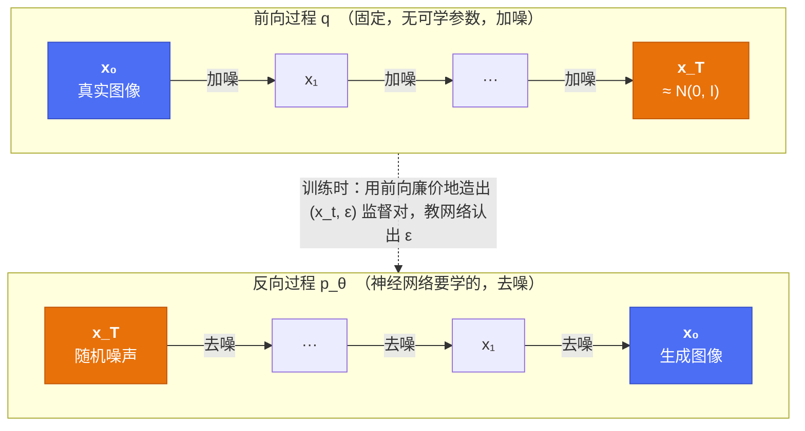

# Diffusion 基础：前向加噪、反向去噪、训练与采样

!!! abstract "这一篇要回答什么"

    - 生成模型为什么绕这么大一圈，非要"先毁掉图像再学着修复"？
    - 为什么前向过程可以**一步跳到任意时刻** \(t\)，不用真的循环加噪一千次？
    - 那个看起来朴素到不像话的损失 \(\|\boldsymbol{\epsilon}-\boldsymbol{\epsilon}_\theta\|^2\)，是怎么从 ELBO 一路化简出来的？
    - 为什么网络要预测**噪声**，而不是直接预测干净图像？

    对应论文：DDPM (Ho et al., 2020)、DDIM (Song et al., 2021)、Improved DDPM (Nichol & Dhariwal, 2021)。

## 1. 出发点：生成建模难在哪

生成建模的任务是：给定一堆样本（比如"所有自然图像"），学到它们的分布 \(p(\mathbf{x})\)，并能从中**采样**出新样本。

难点在于 \(p(\mathbf{x})\) 极其复杂。一张 \(256\times256\) 的 RGB 图像住在 20 万维空间里，而"看起来像真实照片"的那些点，只占据其中一个维度极低、形状极其扭曲的流形。要用一个神经网络一步到位地把简单分布（高斯球）映射到这个流形上，是件很难的事——前作的伤疤都在这：

| 路线 | 做法 | 硬伤 |
|---|---|---|
| **GAN** | 生成器 vs 判别器对抗 | 训练不稳定、mode collapse，覆盖不全 |
| **VAE** | 编码到隐变量再一步解码 | 样本偏糊（高斯似然 + 后验近似的双重代价）|
| **自回归** | 逐像素条件生成 | 数学干净，但生成一张图要几万次前向，太慢 |

## 2. 核心 insight：把一个难问题拆成一千个简单问题

Diffusion 的想法可以用一句话概括：

!!! quote "核心 insight"

    与其学"一步从噪声跳到图像"（太难），不如学"很多步、每步只去掉一点点噪声"（每步都简单到几乎是线性的）。

这个拆解之所以成立，靠的是一个关键的不对称性：

- **把图像毁掉是容易的**——往上加高斯噪声就行，完全不需要学习，甚至有解析解。
- **把图像修复是困难的**——但如果每一步只毁掉了"一点点"，那么修复这一点点，就是个简单到可以被神经网络轻松拟合的任务。

于是我们造一条链：前向一路加噪把图像碾成纯噪声（**固定、无参数**），反向一路去噪把纯噪声还原成图像（**这才是要学的**）。



采样时我们只用反向链；前向链的唯一作用，是在训练期**廉价地伪造出无穷多的训练数据**——任取一张真图、任取一个 \(t\)、任取一个噪声，就得到一组 \((\mathbf{x}_t, \boldsymbol{\epsilon})\) 监督对。

## 3. 前向过程：加噪，以及那个关键的闭式解

### 3.1 定义

每一步往图像里掺一点高斯噪声，同时把原信号按比例缩小一点：

\[
q(\mathbf{x}_t \mid \mathbf{x}_{t-1}) = \mathcal{N}\!\left(\mathbf{x}_t;\ \sqrt{1-\beta_t}\,\mathbf{x}_{t-1},\ \beta_t \mathbf{I}\right)
\]

其中 \(\{\beta_t\}_{t=1}^T\) 是预先设定的 **noise schedule**，\(\beta_t \in (0,1)\) 且通常随 \(t\) 递增。DDPM 原文取 \(T=1000\)，\(\beta_t\) 从 \(10^{-4}\) 线性升到 \(0.02\)。

写成采样形式更直观（重参数化）：

\[
\mathbf{x}_t = \sqrt{1-\beta_t}\,\mathbf{x}_{t-1} + \sqrt{\beta_t}\,\boldsymbol{\epsilon},\qquad \boldsymbol{\epsilon}\sim\mathcal{N}(\mathbf{0},\mathbf{I})
\]

!!! question "为什么缩放系数偏偏是 \(\sqrt{1-\beta_t}\)？"

    为了**保持方差**。假设 \(\mathrm{Var}(\mathbf{x}_{t-1}) = 1\)（数据已归一化），那么

    \[
    \mathrm{Var}(\mathbf{x}_t) = (1-\beta_t)\cdot 1 + \beta_t = 1
    \]

    信号被压缩多少，就正好补进多少噪声，总能量守恒。这类 schedule 因此被称为 **variance preserving (VP)**。若不做这个缩放，随着 \(t\) 增大方差会一路膨胀到爆炸，网络需要处理的数值尺度在不同 \(t\) 之间差几个数量级，根本没法训练。

### 3.2 闭式解：一步跳到任意时刻 t

如果每次采样 \(\mathbf{x}_t\) 都要老老实实循环 \(t\) 次，训练会慢到不可用。幸好高斯的叠加有解析解。记

\[
\alpha_t := 1-\beta_t, \qquad \bar\alpha_t := \prod_{s=1}^{t}\alpha_s
\]

展开两步看看：

\[
\begin{aligned}
\mathbf{x}_t &= \sqrt{\alpha_t}\,\mathbf{x}_{t-1} + \sqrt{1-\alpha_t}\,\boldsymbol{\epsilon}_{t-1}\\
&= \sqrt{\alpha_t}\left(\sqrt{\alpha_{t-1}}\,\mathbf{x}_{t-2} + \sqrt{1-\alpha_{t-1}}\,\boldsymbol{\epsilon}_{t-2}\right) + \sqrt{1-\alpha_t}\,\boldsymbol{\epsilon}_{t-1}\\
&= \sqrt{\alpha_t\alpha_{t-1}}\,\mathbf{x}_{t-2} + \underbrace{\sqrt{\alpha_t(1-\alpha_{t-1})}\,\boldsymbol{\epsilon}_{t-2} + \sqrt{1-\alpha_t}\,\boldsymbol{\epsilon}_{t-1}}_{\text{两个独立高斯之和}}
\end{aligned}
\]

关键的一步：两个独立零均值高斯相加，结果仍是高斯，方差直接相加：

\[
\alpha_t(1-\alpha_{t-1}) + (1-\alpha_t) = 1 - \alpha_t\alpha_{t-1}
\]

所以那一大坨等价于单个 \(\sqrt{1-\alpha_t\alpha_{t-1}}\,\bar{\boldsymbol{\epsilon}}\)。归纳下去即得**本篇最重要的公式**：

\[
\boxed{\ \mathbf{x}_t = \sqrt{\bar\alpha_t}\,\mathbf{x}_0 + \sqrt{1-\bar\alpha_t}\,\boldsymbol{\epsilon},\qquad \boldsymbol{\epsilon}\sim\mathcal{N}(\mathbf{0},\mathbf{I})\ }
\]

即 \(q(\mathbf{x}_t\mid\mathbf{x}_0) = \mathcal{N}(\mathbf{x}_t;\sqrt{\bar\alpha_t}\mathbf{x}_0,\ (1-\bar\alpha_t)\mathbf{I})\)。

这个式子的意义怎么强调都不过分：

- **训练可以随机取 \(t\)**，一次前向就构造出样本，无需循环 —— 这是 diffusion 能训得动的前提。
- \(\sqrt{\bar\alpha_t}\) 就是**信号残留的比例**，\(\sqrt{1-\bar\alpha_t}\) 是**噪声占比**，两者平方和恒为 1。整个前向过程被压缩成了一个"信号与噪声此消彼长"的插值。
- \(\bar\alpha_t\) 单调递减；当 \(\bar\alpha_T \approx 0\) 时 \(\mathbf{x}_T\approx\mathcal{N}(\mathbf{0},\mathbf{I})\)，与 \(\mathbf{x}_0\) 无关 —— 这正是采样时能从纯噪声起步的依据。

### 3.3 Noise schedule：信号该以什么节奏衰减

既然一切由 \(\bar\alpha_t\) 决定，它的形状就是个设计选择。DDPM 的线性 schedule 有个后来被发现的毛病：


/// caption
左：信号残留比例 \(\bar\alpha_t\) 的衰减。右：对数信噪比 \(\log\mathrm{SNR}_t = \log\frac{\bar\alpha_t}{1-\bar\alpha_t}\)。
///

线性 schedule（橙）在 \(t\approx 259\) 就已经丢掉一半信号，到后半程 \(\bar\alpha_t\) 早已贴地——最后 100 步的 \(\bar\alpha_t\) 平均只有 \(1.2\times10^{-4}\)，几乎是在纯噪声上空转。这些步数既没在破坏信息（早毁完了），也就没给网络提供有效的学习信号，等于白白浪费了近四分之一的采样预算。

Improved DDPM 因此改用 **cosine schedule**（蓝）：

\[
\bar\alpha_t = \frac{f(t)}{f(0)},\qquad f(t)=\cos^2\!\left(\frac{t/T+s}{1+s}\cdot\frac{\pi}{2}\right),\quad s=0.008
\]

它到 \(t\approx 496\)（差不多正中间）才丢掉一半信号，末段 \(\bar\alpha_t\) 均值 \(7.9\times10^{-3}\)，比线性高约 60 倍，信息销毁得更均匀，每一步都在干活。实现上还要把由此反推出的 \(\beta_t\) 截断在 0.999 以内，否则末步 \(\bar\alpha_T\) 会精确塌到 0 导致方差退化。

!!! tip "复现这张图"

    图由 [`scripts/gen_noise_schedule.py`](https://github.com/veogeek-no1/world_model_learning/blob/main/scripts/gen_noise_schedule.py) 生成，
    上面这些数字全部来自实际计算而非估计。改 schedule 参数后重跑 `python scripts/gen_noise_schedule.py` 即可更新。

## 4. 反向过程：为什么它也是高斯

我们想要 \(q(\mathbf{x}_{t-1}\mid\mathbf{x}_t)\)——但它需要对整个数据分布积分，无法求得。这里有个漂亮的理论结果救场：

!!! note "关键事实"

    当 \(\beta_t\) 足够小时，反向条件分布 \(q(\mathbf{x}_{t-1}\mid\mathbf{x}_t)\) **也近似是高斯**。

    这正是"必须拆成很多小步"的深层原因：步子迈大了，反向分布会变成复杂的多峰分布（从一张糊图能还原出的清晰图有很多种），高斯就拟合不了了。**\(T\) 大 \(\Leftrightarrow\) 每步 \(\beta_t\) 小 \(\Leftrightarrow\) 反向可用高斯近似**——三者是一回事。

于是用神经网络参数化一个高斯：

\[
p_\theta(\mathbf{x}_{t-1}\mid\mathbf{x}_t) = \mathcal{N}\!\left(\mathbf{x}_{t-1};\ \boldsymbol{\mu}_\theta(\mathbf{x}_t,t),\ \sigma_t^2\mathbf{I}\right)
\]

虽然 \(q(\mathbf{x}_{t-1}\mid\mathbf{x}_t)\) 求不出，但**多给一个条件 \(\mathbf{x}_0\)，后验就有解析解**（贝叶斯 + 配方即可推出）：

\[
q(\mathbf{x}_{t-1}\mid\mathbf{x}_t,\mathbf{x}_0) = \mathcal{N}\!\left(\mathbf{x}_{t-1};\ \tilde{\boldsymbol{\mu}}_t(\mathbf{x}_t,\mathbf{x}_0),\ \tilde\beta_t\mathbf{I}\right)
\]

\[
\tilde{\boldsymbol{\mu}}_t(\mathbf{x}_t,\mathbf{x}_0) = \frac{\sqrt{\bar\alpha_{t-1}}\,\beta_t}{1-\bar\alpha_t}\mathbf{x}_0 + \frac{\sqrt{\alpha_t}\,(1-\bar\alpha_{t-1})}{1-\bar\alpha_t}\mathbf{x}_t,
\qquad
\tilde\beta_t = \frac{1-\bar\alpha_{t-1}}{1-\bar\alpha_t}\beta_t
\]

训练时 \(\mathbf{x}_0\) 是已知的（就是那张真图），所以这个后验可以当作**监督目标**。这就是整个训练目标的支点。

## 5. 训练目标：从 ELBO 到一行 MSE

### 5.1 变分上界

和 VAE 同款套路，对负对数似然取变分上界：

\[
\mathbb{E}\left[-\log p_\theta(\mathbf{x}_0)\right] \le \mathbb{E}_q\left[-\log\frac{p_\theta(\mathbf{x}_{0:T})}{q(\mathbf{x}_{1:T}\mid\mathbf{x}_0)}\right] =: L
\]

经过整理（关键是把联合分布按马尔可夫链拆开，并把 \(q(\mathbf{x}_{t-1}|\mathbf{x}_t)\) 用带 \(\mathbf{x}_0\) 的后验替换），\(L\) 可以分解成逐项的 KL：

\[
L = \underbrace{D_{\mathrm{KL}}\!\left(q(\mathbf{x}_T|\mathbf{x}_0)\,\|\,p(\mathbf{x}_T)\right)}_{L_T:\ \text{无可学参数，常数}}
+ \sum_{t=2}^{T}\underbrace{D_{\mathrm{KL}}\!\left(q(\mathbf{x}_{t-1}|\mathbf{x}_t,\mathbf{x}_0)\,\|\,p_\theta(\mathbf{x}_{t-1}|\mathbf{x}_t)\right)}_{L_{t-1}:\ \text{主项}}
\underbrace{-\log p_\theta(\mathbf{x}_0|\mathbf{x}_1)}_{L_0:\ \text{重建项}}
\]

\(L_T\) 不含 \(\theta\)，直接扔掉。主项 \(L_{t-1}\) 是**两个高斯之间的 KL**，有闭式解——在方差固定为 \(\sigma_t^2\) 时，它退化成两个均值的平方距离：

\[
L_{t-1} = \mathbb{E}_q\left[\frac{1}{2\sigma_t^2}\left\|\tilde{\boldsymbol{\mu}}_t(\mathbf{x}_t,\mathbf{x}_0) - \boldsymbol{\mu}_\theta(\mathbf{x}_t,t)\right\|^2\right] + C
\]

到这里，"学一个分布"已经变成了"回归一个均值"。

### 5.2 换元：为什么预测噪声

现在做一步关键换元。由闭式解反解出 \(\mathbf{x}_0\)：

\[
\mathbf{x}_0 = \frac{1}{\sqrt{\bar\alpha_t}}\left(\mathbf{x}_t - \sqrt{1-\bar\alpha_t}\,\boldsymbol{\epsilon}\right)
\]

代入 \(\tilde{\boldsymbol{\mu}}_t\) 并化简，那堆系数会奇迹般地塌缩成：

\[
\tilde{\boldsymbol{\mu}}_t = \frac{1}{\sqrt{\alpha_t}}\left(\mathbf{x}_t - \frac{\beta_t}{\sqrt{1-\bar\alpha_t}}\,\boldsymbol{\epsilon}\right)
\]

这个形式在说一件很直白的事：**\(\mathbf{x}_t\) 是已知的，均值里唯一未知的东西就是 \(\boldsymbol{\epsilon}\)**。那网络干脆就去预测 \(\boldsymbol{\epsilon}\) 好了。于是让网络输出 \(\boldsymbol{\epsilon}_\theta(\mathbf{x}_t,t)\)，并把均值参数化成同样的形状：

\[
\boldsymbol{\mu}_\theta(\mathbf{x}_t,t) = \frac{1}{\sqrt{\alpha_t}}\left(\mathbf{x}_t - \frac{\beta_t}{\sqrt{1-\bar\alpha_t}}\,\boldsymbol{\epsilon}_\theta(\mathbf{x}_t,t)\right)
\]

两式相减，\(\mathbf{x}_t\) 项完全抵消，只剩噪声的差：

\[
L_{t-1} = \mathbb{E}\left[\frac{\beta_t^2}{2\sigma_t^2\,\alpha_t(1-\bar\alpha_t)}\left\|\boldsymbol{\epsilon}-\boldsymbol{\epsilon}_\theta(\mathbf{x}_t,t)\right\|^2\right]
\]

DDPM 最后一刀：**把前面那个复杂的权重直接扔掉，设为 1**。得到大道至简的

\[
\boxed{\ L_{\text{simple}} = \mathbb{E}_{t\sim\mathcal{U}[1,T],\ \mathbf{x}_0,\ \boldsymbol{\epsilon}}\left[\left\|\boldsymbol{\epsilon}-\boldsymbol{\epsilon}_\theta\!\left(\sqrt{\bar\alpha_t}\mathbf{x}_0+\sqrt{1-\bar\alpha_t}\boldsymbol{\epsilon},\ t\right)\right\|^2\right]\ }
\]

一个 ELBO 推导，最后落地成一行 MSE。

!!! question "为什么预测 \(\boldsymbol{\epsilon}\) 比预测 \(\mathbf{x}_0\) 好？"

    数学上两者可以互相换算，**等价**——预测出 \(\boldsymbol{\epsilon}\) 就等于预测出 \(\mathbf{x}_0\)。差别在优化性质上：

    - **任务难度在 \(t\) 上是均衡的**。预测 \(\mathbf{x}_0\) 时，\(t\) 小几乎白送（图基本是干净的），\(t\) 大则近乎无解（要从纯噪声里凭空变出图）——难度跨越好几个数量级，损失尺度极不均衡。而预测 \(\boldsymbol{\epsilon}\) 时，无论 \(t\) 多大，目标始终是个标准正态样本，尺度恒定。
    - **输出分布恒定**。网络的输出目标永远是 \(\mathcal{N}(\mathbf{0},\mathbf{I})\)，不随 \(t\) 漂移，对归一化和训练稳定性都友好。
    - **扔掉权重反而更好**。那个被丢弃的权重 \(\frac{\beta_t^2}{2\sigma_t^2\alpha_t(1-\bar\alpha_t)}\) 在 \(t\) 小时很大。丢掉它相当于**降低了小 \(t\)（简单去噪）的权重、抬高了大 \(t\)（粗粒度结构）的权重**，把模型容量引导到更影响观感的全局结构上。DDPM 报告这样 FID 更好——一个"理论上不严格、实践上更优"的经典案例。

### 5.3 训练循环

化简之后，训练朴素得惊人：

```python
# 每个 step：
x0 = sample_batch()                                  # 真实图像
t  = randint(1, T, size=batch)                       # 随机时间步
eps = randn_like(x0)                                 # 目标噪声

xt = sqrt(abar[t]) * x0 + sqrt(1 - abar[t]) * eps    # 闭式解，一步到位
loss = mse(eps_theta(xt, t), eps)                    # 就这一行
loss.backward()
```

没有对抗、没有额外判别器、没有采样循环。**训练稳定性正是 diffusion 打败 GAN 的关键**。

## 6. 采样：把噪声一步步搬回图像

### 6.1 DDPM 祖先采样

训练完，从 \(\mathbf{x}_T\sim\mathcal{N}(\mathbf{0},\mathbf{I})\) 出发，逐步去噪：

\[
\mathbf{x}_{t-1} = \frac{1}{\sqrt{\alpha_t}}\left(\mathbf{x}_t - \frac{\beta_t}{\sqrt{1-\bar\alpha_t}}\,\boldsymbol{\epsilon}_\theta(\mathbf{x}_t,t)\right) + \sigma_t\mathbf{z},\qquad \mathbf{z}\sim\mathcal{N}(\mathbf{0},\mathbf{I})
\]

最后一步（\(t=1\)）不加噪声。\(\sigma_t^2\) 取 \(\beta_t\) 或 \(\tilde\beta_t\) 实践中差别不大。

注意末尾那个 \(\sigma_t\mathbf{z}\)：**每步都要重新注入随机噪声**。初看很反直觉——好不容易去掉噪声，为什么又加回去？因为 \(\boldsymbol{\mu}_\theta\) 只是后验的**均值**，直接沿均值走等于每步都取众数，会塌向过度平滑的"平均脸"。加回的噪声让采样真正从分布里抽样，是多样性的来源。

**代价**：\(T=1000\) 意味着生成一张图要 1000 次网络前向。这是 diffusion 最痛的地方。

### 6.2 DDIM：把随机链改成确定性映射

DDIM 的洞察是：\(L_{\text{simple}}\) 只依赖边缘分布 \(q(\mathbf{x}_t|\mathbf{x}_0)\)，**并不要求前向过程必须是马尔可夫链**。于是可以构造一族非马尔可夫过程，它们的边缘分布完全相同（因此**训练好的模型可以直接复用，无需重训**），但采样时可以跳步：

\[
\mathbf{x}_{t-1} = \sqrt{\bar\alpha_{t-1}}\underbrace{\left(\frac{\mathbf{x}_t-\sqrt{1-\bar\alpha_t}\,\boldsymbol{\epsilon}_\theta(\mathbf{x}_t,t)}{\sqrt{\bar\alpha_t}}\right)}_{\hat{\mathbf{x}}_0:\ \text{当前对原图的估计}} + \underbrace{\sqrt{1-\bar\alpha_{t-1}-\sigma_t^2}\cdot\boldsymbol{\epsilon}_\theta(\mathbf{x}_t,t)}_{\text{指向}\ \mathbf{x}_{t-1}\ \text{的方向}} + \sigma_t\mathbf{z}
\]

结构非常好读：**先跳到对干净图像的估计 \(\hat{\mathbf{x}}_0\)，再按新的噪声水平退回去一点**。

令 \(\sigma_t=0\) 则随机项消失，采样变成**完全确定性**的：给定 \(\mathbf{x}_T\) 就唯一确定 \(\mathbf{x}_0\)。这带来两个后果：

- **可跳步**。既然是确定性 ODE 式的轨迹，就能用大步长求解，\(1000\to 50\) 步质量几乎不掉。
- **latent 有了语义**。\(\mathbf{x}_T\) 成为图像的确定性编码，在两个 \(\mathbf{x}_T\) 之间插值可以得到语义连续的过渡——DDPM 做不到这点。

## 7. 另一个视角：score matching

值得知道的一个联系。对闭式解求对数梯度：

\[
\nabla_{\mathbf{x}_t}\log q(\mathbf{x}_t\mid\mathbf{x}_0) = -\frac{\mathbf{x}_t-\sqrt{\bar\alpha_t}\mathbf{x}_0}{1-\bar\alpha_t} = -\frac{\boldsymbol{\epsilon}}{\sqrt{1-\bar\alpha_t}}
\]

所以噪声预测网络和 **score function**（对数概率密度的梯度）只差一个常数：

\[
\mathbf{s}_\theta(\mathbf{x}_t,t) \approx -\frac{\boldsymbol{\epsilon}_\theta(\mathbf{x}_t,t)}{\sqrt{1-\bar\alpha_t}}
\]

这意味着 DDPM 训练的东西，本质上就是在做 **denoising score matching**；采样则是在 score 场里做 Langevin 式的爬升——**朝着"更像真实数据"的方向走**。Song & Ermon 的 score-based 路线与 DDPM 是同一枚硬币的两面，后来被 Score SDE 统一进了同一个连续时间框架。这个视角是理解后续 flow matching 的桥梁。

## 8. 小结与遗留瓶颈

- 前向加噪**固定无参**，闭式解 \(\mathbf{x}_t=\sqrt{\bar\alpha_t}\mathbf{x}_0+\sqrt{1-\bar\alpha_t}\boldsymbol{\epsilon}\) 让训练可以随机取 \(t\)、一步构造样本。
- 反向去噪靠神经网络；因为每步 \(\beta_t\) 很小，反向分布可用高斯近似——这是"必须多步"的根本原因。
- ELBO 一路化简，落地成一行 MSE \(\|\boldsymbol{\epsilon}-\boldsymbol{\epsilon}_\theta\|^2\)；预测噪声让任务难度在 \(t\) 上均衡，扔掉权重反而提升观感质量。
- DDIM 用非马尔可夫构造把采样变确定性，\(1000\to50\) 步，且模型无需重训。

留给后续的坑，正好是接下来几篇的动机：

| 瓶颈 | 谁来解决 |
|---|---|
| 采样仍需几十步，且在**像素空间**做，高分辨率算力爆炸 | `latent-diffusion.md`：搬进 VAE 潜空间 |
| 加噪时间表、离散步数都是人为设定，路径弯弯绕绕 | `flow-matching.md`：直接学速度场，走直线 |
| 去噪骨干 U-Net 是卷积时代产物，scaling 行为不明 | `dit-arch.md`：换成 Transformer |

（上面三篇尚未动笔，写完后这里会改成站内链接。）

## 参考文献

- Ho, J., Jain, A., & Abbeel, P. (2020). *Denoising Diffusion Probabilistic Models*. [arXiv:2006.11239](https://arxiv.org/abs/2006.11239)
- Song, J., Meng, C., & Ermon, S. (2021). *Denoising Diffusion Implicit Models*. [arXiv:2010.02502](https://arxiv.org/abs/2010.02502)
- Nichol, A., & Dhariwal, P. (2021). *Improved Denoising Diffusion Probabilistic Models*. [arXiv:2102.09672](https://arxiv.org/abs/2102.09672)
- Song, Y., et al. (2021). *Score-Based Generative Modeling through Stochastic Differential Equations*. [arXiv:2011.13456](https://arxiv.org/abs/2011.13456)
- Luo, C. (2022). *Understanding Diffusion Models: A Unified Perspective*. [arXiv:2208.11970](https://arxiv.org/abs/2208.11970) —— 推导细节最全的一篇综述
