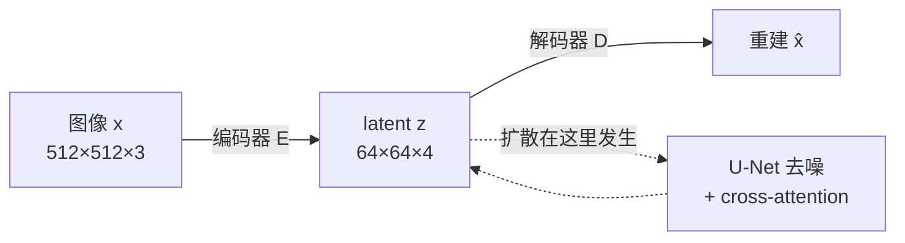

# Latent Diffusion：把扩散搬进压缩空间

!!! abstract "这一篇要回答什么"

    - 在像素空间做扩散，算力到底浪费在哪了？为什么"加大显卡"不是答案？
    - 为什么压缩这一步要交给一个**单独训练**的自编码器，而不是让扩散模型自己学？
    - 那个自编码器为什么不能是教科书里的 VAE——为什么非要加感知损失和一个判别器？
    - 压缩率 \(f\) 该怎么选？太小太大分别坏在哪？
    - 搬进 latent 之后，前两篇讲的东西有哪些要改？（剧透：几乎都不用改）

    对应论文：Latent Diffusion / Stable Diffusion (Rombach et al., 2022)。

## 1. 像素空间的账：算力花在了看不见的地方

基础篇末尾留下的瓶颈是：采样要几十步，每步都在**像素空间**跑一次完整的 U-Net。先把这笔账算清楚。

一张 \(512\times512\) 的 RGB 图有 262144 个空间位置。U-Net 里的卷积层开销随空间位置数**线性**增长，而 self-attention 层随其**平方**增长。再乘以几十个采样步——训练和推理的代价都高得离谱。

但真正的问题不是"数字大"，而是**这些算力买到了什么**。

### 1.1 感知压缩与语义压缩

数字图像的比特分布极不均匀：**绝大部分比特用于编码人眼根本察觉不到的高频细节**——传感器噪点、纹理的精确排布、压缩伪影。而决定这张图"是什么"的语义结构，只占很小一部分。

这正是 JPEG 能把文件压掉一个数量级还看不出差别的原因。用 rate-distortion 的语言说，失真曲线上存在一个明显的拐点：**在拐点之前，丢掉的比特几乎不影响感知质量；越过拐点，才开始伤及内容。**

于是可以把生成建模的压缩分成两段：

| | 感知压缩 | 语义压缩 |
|---|---|---|
| 丢掉什么 | 人眼不可见的高频细节 | 无 —— 这里要**建模**而非丢弃 |
| 难度 | 低，卷积自编码器足够 | 高，这才是生成建模的真正难点 |
| 该由谁做 | 一个训练一次就固定的自编码器 | 扩散模型 |

**像素空间扩散的浪费就在这里：它被迫用宝贵的模型容量和采样算力，去建模那些人眼看不见的细节。** 每一步去噪都在小心翼翼地还原噪点级的高频信息，而这部分对最终观感几乎没有贡献。

### 1.2 LDM 的分工

结论就很自然了：**先用一个便宜的自编码器把感知冗余压掉，再让扩散模型在压缩后的空间里专心做语义建模。**



两个阶段**分开训练**，且第一阶段只训一次：

1. **阶段一**：训练自编码器 \((\mathcal{E},\mathcal{D})\)，学会把图像压到 latent 再还原回来。训完**冻结**。
2. **阶段二**：把训练集全部编码成 latent，在 latent 上跑基础篇那一整套扩散训练。

!!! tip "分开训练带来的一个被低估的好处"

    自编码器与具体任务无关——它只管"压缩图像"这件事。所以**同一个自编码器可以被无数个下游扩散模型复用**：文生图、图生图、超分、inpainting，换的只是第二阶段。

    这也是 Stable Diffusion 生态能繁荣的结构性原因：社区微调的成百上千个模型共享同一个 VAE，latent 空间因此是**通用货币**——LoRA、ControlNet 这些插件才可能跨模型迁移。

### 1.3 省了多少

以 SD 采用的 \(f=8\)（每个方向下采样 8 倍）为例，\(512\times512\to 64\times64\)：

| | 像素空间 | latent 空间 | 倍数 |
|---|---|---|---|
| 空间位置数 | 262144 | 4096 | **64×** |
| 卷积层开销（\(\propto hw\)） | — | — | **64×** |
| self-attention 开销（\(\propto (hw)^2\)） | — | — | **4096×** |

注意 attention 那一行——**这才是让高分辨率生成从"研究机构专属"变成"消费级显卡可跑"的关键**。前一篇讲的 cross-attention 也同样受益：它的 Query 序列长度就是空间位置数，从 262144 降到 4096。

## 2. 阶段一：这个自编码器为什么不像个 VAE

代码里它叫 `AutoencoderKL`，听起来就是个 VAE。但它的训练方式和标准 VAE 差得很远，两处改动都是要害。

### 2.1 重建损失：光靠 L1/L2 会糊

基础篇第 1 节说过 VAE 的病根：**用逐像素 L2 去拟合一个本质多解的问题**。给定一个 latent，可能的重建有很多个都合理，L2 的最优解是把它们**平均**——于是出图偏糊。

如果第一阶段也栽在这里，那整个 LDM 就没有意义了：**自编码器的重建质量是后面一切的上限**，它糊了，扩散模型画得再好也救不回来。

LDM 的对策是在重建损失之外加两项。论文正文的说法是：

> consists of an autoencoder trained by combination of a **perceptual loss** and a **patch-based adversarial objective**. This ensures that the reconstructions are confined to the image manifold by enforcing local realism and avoids blurriness introduced by relying **solely** on pixel-space losses such as \(L_2\) or \(L_1\) objectives.

对照官方实现（`ldm/modules/losses/contperceptual.py`），完整的目标其实是四项相加：

| 项 | 作用 |
|---|---|
| **L1 重建损失** | 保证像素级大致对齐（注意实现里是 L1 不是 L2） |
| **LPIPS 感知损失** | 在预训练网络的特征空间比对，捕捉"看起来像不像"而非"数值差多少" |
| **patch 判别器**（hinge 形式） | 逼迫局部纹理落在真实图像流形上——直接治糊 |
| **正则项** | KL 或 VQ，见下节 |

!!! note "注意措辞：不是「不用 L1/L2」，而是「不能只用」"

    论文原文是 "relying **solely** on"。像素损失仍然在，只是**不能独当一面**。这一点容易被转述成"LDM 抛弃了像素损失"，是错的。

    实现上还有两个细节值得知道：GAN 项带**自适应权重**（按重建损失与 GAN 损失各自对最后一层的梯度范数之比来定），且在 `disc_start` 步之前**完全不启用**——先让重建学稳，再引入对抗，否则训练早期判别器会把生成器带崩。这是 VQGAN 传下来的工程经验。

**所以这个"VAE"其实是个 VQGAN 血统的自编码器**——LDM 论文自己也说，VQ 那一版"可以理解为一个 VQGAN，只是把量化层吸收进了解码器"。

### 2.2 正则化：故意做得极弱

第二处改动更反直觉。LDM 提供两种正则：

- **KL-reg**：对 latent 施加一个朝标准正态的 KL 惩罚，形式上和 VAE 一样；
- **VQ-reg**：在解码器内部放一个向量量化层。

关键在权重。论文 Appendix G：

> To obtain high-fidelity reconstructions we only use a **very small regularization** for both scenarios, i.e. we either weight the \(\mathbb{KL}\) term by a factor \(\sim 10^{-6}\) or choose a high codebook dimensionality.

官方配置里 `kl_weight: 0.000001`——**比标准 VAE 的 \(\beta\approx 1\) 小六个数量级**。

为什么？因为**这里根本不需要 latent 逼近 \(\mathcal{N}(0,\mathbf{I})\)**。

标准 VAE 必须让后验贴近先验，因为它要**直接从先验采样**再解码生成图像——latent 分布不对，采出来就是垃圾。但 LDM 不这么用：**latent 的分布由第二阶段的扩散模型去建模**，那才是它的专长。第一阶段只要负责"压得下、还得回"就行。

正则留一点点，只为一个卑微的目的——防止 latent 尺度失控。论文原话是 "In order to avoid arbitrarily **high-variance** latent spaces"。

!!! tip "一句话看穿两阶段的分工"

    **标准 VAE 里，编码器要同时干"压缩"和"规整分布"两件事，这两个目标互相打架**——正则强了重建糊，正则弱了没法采样。这正是 VAE 出图偏糊的结构性原因。

    LDM 把它们拆开了：**自编码器只管压缩（正则弱到几乎不存在），分布建模全权交给扩散模型**。各司其职，两边都不必妥协。从这个角度看，LDM 与其说是"在 VAE 里做扩散"，不如说是**用扩散模型替换掉了 VAE 那个不堪重任的高斯先验**。

## 3. 压缩率 f 怎么选

LDM 系统地扫了 \(f\in\{1,2,4,8,16,32\}\)，其中 \(f=1\) 就是像素空间扩散（即退化回 DDPM 那一档）。结论（Sec 4.1）：

> i) small downsampling factors for LDM-{1,2} result in **slow training progress**, whereas ii) overly large values of \(f\) cause **stagnating fidelity** after comparably few training steps. … we attribute this to i) **leaving most of perceptual compression to the diffusion model** and ii) **too strong first stage compression resulting in information loss**.

两端各有各的坏法，而且坏因正好对称：

| | 症状 | 根因 |
|---|---|---|
| **\(f\) 太小**（1, 2） | 训练极慢 | 感知压缩没做完，**扩散模型被迫接着干这个脏活**——回到了第 1 节说的浪费 |
| **\(f\) 太大**（32） | 质量很快见顶，之后再训也不涨 | 第一阶段压过头，**信息已经丢了**，扩散模型再强也超不过重建上限 |

论文的落点是 **LDM-4 到 LDM-16 是合理区间，其中 4 和 8 最优**。一个很有说服力的数字：训练 2M 步后，**像素空间的 LDM-1 与 LDM-8 之间有 38 的 FID 差距**——不是小修小补，是量级差异。

SD 选了 \(f=8\)。

!!! warning "别把 LDM 论文和 Stable Diffusion 的数字混在一起"

    LDM **论文里的文生图模型是 256×256 的**，latent 形状 \(32\times32\times4\)。\(512\times512\to 64\times64\times4\) 是后来 Stable Diffusion 的配置。两者 \(f\) 都是 8，但分辨率不同，引用时容易张冠李戴。

顺带看一眼第一阶段自编码器本身的重建质量（论文 Table 8，ImageNet-Val），能直观感受 \(f\) 的代价：

| 正则 | \(f\) | 通道数 \(c\) | R-FID ↓ | PSNR ↑ |
|---|---|---|---|---|
| KL | 2 | 2 | 0.086 | 32.47 |
| KL | 4 | 3 | 0.27 | 27.53 |
| **KL** | **8** | **4** | **0.90** | **24.19** |
| KL | 16 | 16 | 0.87 | 24.08 |
| KL | 32 | 64 | 2.04 | 22.27 |
| VQ | 8 | 4 | 1.14 | 23.07 |

注意这张表读的是**重建**质量，不是生成质量——它标出的是天花板在哪，而不是模型能到哪。\(f\) 越小重建越好，但第 1 节那笔算力账就越省不下来。**\(f=8\) 是"重建够用"与"算力可承受"之间的那个折中点。**

## 4. 阶段二：扩散部分几乎原样搬过来

好消息：前两篇讲的所有东西**全部原样成立**。把 \(\mathbf{x}_t\) 理解成"latent 上的带噪张量"而不是"图像上的带噪张量"，闭式解、\(L_{\text{simple}}\)、DDIM 采样、cross-attention、CFG——一个公式都不用改。

训练流程只多了两步包装：

```python
z = encoder(x) * scale_factor        # 编码 + 缩放，VAE 冻结不训
# ... 中间是基础篇那一整套扩散训练，一字不变 ...
x_hat = decoder(z_sampled / scale_factor)   # 采样完再解码回图像
```

两个实现细节值得单独说。

### 4.1 VAE 是冻结的

第二阶段训练时自编码器**完全不更新**（`requires_grad = False`，且强制 `eval()` 模式）。两阶段彻底解耦——这正是 1.2 节说的"训一次、复用于无数下游模型"能成立的实现基础。

### 4.2 那个神秘的 0.18215

SD 的配置文件里有个裸数字 `scale_factor: 0.18215`，论文里找不到它，第一次看到会很困惑。

来由是 2.2 节埋的雷：**KL 权重只有 \(10^{-6}\)，几乎不约束方差**，导致 latent 的实际标准差远不是 1。而基础篇那套噪声 schedule（\(\bar\alpha_t\) 的设计、\(\mathbf{x}_t=\sqrt{\bar\alpha_t}\mathbf{x}_0+\sqrt{1-\bar\alpha_t}\boldsymbol{\epsilon}\)）**默认数据是单位方差量级的**。方差不匹配，信噪比 \(\mathrm{Var}(z)/\sigma_t^2\) 就会系统性偏高——相当于加噪加得不够狠，模型在很早的步骤就把细节定死了。

所以要把 latent 归一化。做法是拿训练启动时第一个 batch 估计逐分量标准差，然后

\[
z \leftarrow \frac{z}{\hat\sigma},\qquad \text{代码里 } \texttt{scale\_factor} = 1/\hat\sigma
\]

反推可知这个 VAE 的 latent 标准差 \(\hat\sigma\approx 5.49\)。

!!! note "这是个 VAE 权重相关的量，不是普适常数"

    - **VQ-reg 的 latent 方差本来就接近 1**，根本不需要缩放——这个数字是 KL-reg 路线特有的补丁。
    - 不同模型的值不同：SD 1.x / 2.x 是 `0.18215`，**SDXL 是 `0.13025`**，SD3 和 FLUX 换了 VAE 又各不相同，且额外引入了 `shift_factor`（不只缩放，还要平移）。
    - SD3 的做法比 SD1 严谨：用**训练数据子集上的全局均值和标准差**，而不是碰运气的第一个 batch。

    换 VAE 就必须换这个数，配错了出图会是一片噪声或者一片灰——这是自己拼推理管线时最常见的坑之一。

## 5. 代价：重建天花板

latent diffusion 不是免费的。压缩必然有损，而**自编码器的重建质量构成了整个系统的硬上限**。SD3 论文把这点说得最直白：

> The **reconstruction quality of this autoencoder provides an upper bound** on the achievable image quality after latent diffusion training.

无论扩散模型多强，它生成的 latent 最终要过解码器——解码器还原不出来的东西，就是还原不出来。

### 5.1 4 个通道够吗

Emu 论文（Dai et al., 2023）对 SD 沿用的 4 通道设计提出了明确批评：

> the commonly used 4-channel autoencoder (AE-4) architecture often results in a **loss of details** in the reconstructed images due to its high compression rate. The issue is especially noticeable in **small objects**.

它的直觉论证很好懂：**空间上压了 64 倍，通道却只从 3 涨到 4**。信息总量压缩了约 48 倍，而这些预算要同时承载颜色、纹理、结构——细小的东西首先牺牲。

!!! warning "论文只说 small objects，人脸和文字是社区的经验具体化"

    SD 1.4 的 model card 确实同时列了三条局限：**"cannot render legible text"、"faces and people may not be generated properly"、"the autoencoding part of the model is lossy"**——但它们是**并列**的，官方**没有**把前两条归因于第三条。

    我没有找到哪篇一手论文明确写出"\(f=8\)、4 通道 VAE 在小人脸和细小文字上的重建损失"。论文层面能引用的最强表述就是 Emu 的 "small objects" 和 "fine details"。

    想验证的话，有个比引文更有说服力的办法：**拿 VAE 对一张含小字和小人脸的图做 encode-decode round-trip，直接看重建结果**——如果原图过一遍 VAE 就已经糊了，那就与扩散模型无关，是天花板问题。这个实验可复现，值得自己跑一次。

### 5.2 提通道数不是免费午餐

SD3 把通道数从 4 提到 16，重建指标全面改善（Table 3，\(f=8\) 固定）：

| | 4 通道 | 8 通道 | 16 通道 |
|---|---|---|---|
| rFID ↓ | 2.41 | 1.56 | **1.06** |
| Perceptual Similarity ↓ | 0.85 | 0.68 | **0.45** |
| PSNR ↑ | 25.12 | 26.40 | **28.62** |

但故事有第二半，**而且这半才是重点**。SD3 的 Figure 10 显示：

> As expected, the flow model trained on the 16-channel autoencoder space **needs more model capacity** to achieve similar performance. At depth [d], the gap between 8-chn and 16-chn becomes negligible. We opt for the 16-chn model as we ultimately aim to **scale to much larger model sizes**.

也就是说——**提高通道数抬高了天花板，同时也让生成任务变难了**。latent 维度高，意味着扩散模型要预测的东西更复杂；在小模型上，16 通道甚至打不过 8 通道，要到足够大的模型规模才回本。

**SD3 选 16 是一个押注 scaling 的决策，不是"16 就是更好"。** 这是个很典型的例子：一个看起来纯属改进的超参，实际上把权衡从一处挪到了另一处。

顺带一提，SDXL 走的是另一条路：**通道数和 \(f\) 都不动，只是把 VAE 重训得更好**（batch size 从 9 提到 256、加 EMA），rFID 从 5.0 改善到 4.7。用它自己的话说：

> While the bulk of the **semantic composition** is done by the LDM, we can improve **local, high-frequency details** by improving the autoencoder.

这句话正好回到第 1 节的分工——**语义归扩散模型，高频细节归自编码器**，两者可以独立优化。

（FLUX 据第三方逆向分析也用 \(f=8\)、16 通道，但 BFL 未发布官方技术报告，这条我没能从一手材料核实。）

## 6. 小结

- 像素空间扩散的浪费在于：**绝大部分比特编码的是人眼看不见的细节**，而扩散模型被迫用模型容量和采样算力去建模它们。
- LDM 的解法是**分工**：自编码器做感知压缩（便宜、训一次、冻结、可复用），扩散模型做语义建模。\(f=8\) 时空间位置数降 64 倍，**self-attention 开销降约 4096 倍**——这是高分辨率生成能落地到消费级显卡的直接原因。
- 那个自编码器**不是标准 VAE**：重建损失之外加了 LPIPS 和 patch 判别器来治糊，正则则被刻意压到 \(10^{-6}\)。因为它**不需要**让 latent 贴近先验——分布建模是扩散模型的活。**LDM 本质上是用扩散模型替换掉了 VAE 那个不堪重任的高斯先验。**
- \(f\) 两端各有坏法且成因对称：太小则感知压缩的脏活推给了扩散模型（训练慢），太大则信息已丢（质量见顶）。
- 第二阶段**一个公式都不用改**，只多了编码/解码和一个方差归一化的 `scale_factor`——而这个数是 VAE 相关的，换模型必须换。
- 代价是**重建天花板**。提通道数能抬高天花板，但会让生成任务变难，**只在大模型 regime 下才回本**。

留给后续的坑：

| 瓶颈 | 谁来解决 |
|---|---|
| U-Net 是卷积时代产物，scaling 行为不明；而 latent 已经是"小而稠密"的张量，正适合 Transformer | `dit-arch.md`：patchify + adaLN-Zero |
| 加噪 schedule 与 latent 方差强耦合（`scale_factor` 就是这个耦合的补丁），路径弯绕 | `flow-matching.md`：直接学速度场 |
| 采样仍需几十步 × 两次前向（CFG） | 蒸馏与少步采样 |
| 压缩是**逐帧**的，视频还多一个时间维度的冗余 | `video-dit.md`：时空联合压缩 |

（上述篇目尚未动笔，写完后改成站内链接。）

## 参考文献

- Rombach, R., et al. (2022). *High-Resolution Image Synthesis with Latent Diffusion Models*. [arXiv:2112.10752](https://arxiv.org/abs/2112.10752)
- Esser, P., Rombach, R., & Ommer, B. (2021). *Taming Transformers for High-Resolution Image Synthesis* (VQGAN). [arXiv:2012.09841](https://arxiv.org/abs/2012.09841)
- Zhang, R., et al. (2018). *The Unreasonable Effectiveness of Deep Features as a Perceptual Metric* (LPIPS). [arXiv:1801.03924](https://arxiv.org/abs/1801.03924)
- Isola, P., et al. (2017). *Image-to-Image Translation with Conditional Adversarial Networks* (pix2pix / PatchGAN). [arXiv:1611.07004](https://arxiv.org/abs/1611.07004)
- Dai, X., et al. (2023). *Emu: Enhancing Image Generation Models Using Photogenic Needles in a Haystack*. [arXiv:2309.15807](https://arxiv.org/abs/2309.15807) —— 4 通道 latent 在小物体上丢细节（§3.1）
- Podell, D., et al. (2023). *SDXL*. [arXiv:2307.01952](https://arxiv.org/abs/2307.01952) —— 不改 \(f\) 与通道数、只重训 VAE 的路线（§2.4）
- Esser, P., et al. (2024). *Scaling Rectified Flow Transformers for High-Resolution Image Synthesis* (SD3). [arXiv:2403.03206](https://arxiv.org/abs/2403.03206) —— 通道数消融与"重建质量是上限"（§5.2.1、Fig. 10）

**实现参考**

- [`CompVis/latent-diffusion`](https://github.com/CompVis/latent-diffusion) —— `ldm/modules/losses/contperceptual.py`（四项损失的实际组合）
- [`CompVis/stable-diffusion`](https://github.com/CompVis/stable-diffusion) —— `configs/stable-diffusion/v1-inference.yaml`（`scale_factor`、\(f=8\) 的由来）
