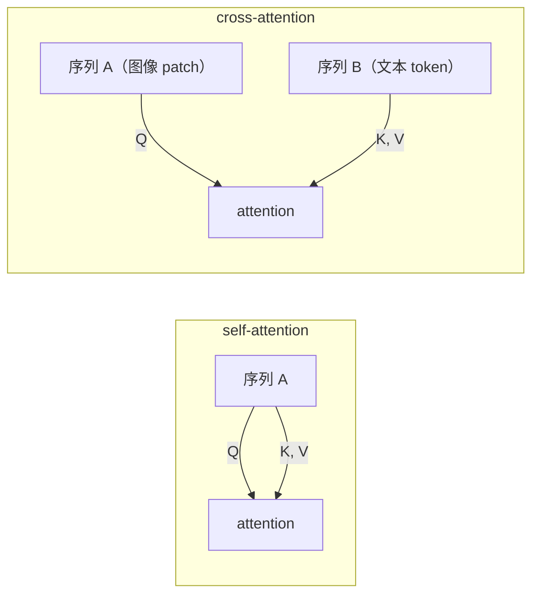
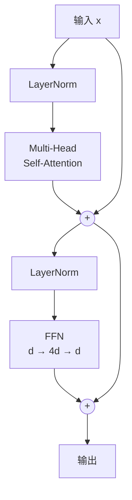
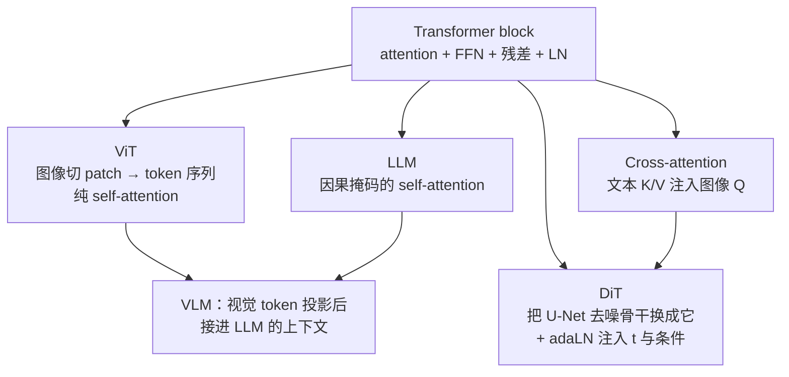

# Transformer 与 attention：一套被两条主线共用的零件

!!! abstract "这一篇要回答什么"

    - RNN 和 CNN 到底在序列建模上败在哪，才逼出了 attention？
    - QKV 这三个投影为什么必须是三个，而不是一个或两个？那个 \(\sqrt{d}\) 又是从哪来的？
    - self-attention 和 cross-attention 的区别，是不是只有"K/V 从哪来"这一处？
    - 多头在分什么工？一个头为什么不够？
    - 一个 Transformer block 里，attention 和 FFN 各自负责什么——为什么参数的大头其实在 FFN？
    - attention 天生看不见顺序，位置信息是怎么补进去的？

    对应论文：Transformer (Vaswani et al., 2017)、Pre-LN 分析 (Xiong et al., 2020)、RoFormer/RoPE (Su et al., 2021)、ViT (Dosovitskiy et al., 2020)。

!!! note "为什么这篇放在两条主线之前"

    Transformer 不属于 VLM，也不属于 DiT——它是两边共用的地基：VLM 的视觉编码器（ViT）、语言主干（LLM）、图文对齐用的是它；DiT 的全部内容就是"把去噪骨干换成它"；文生图的条件注入（[条件机制](../dit/conditioning.md)）用的是它的 cross-attention 变体。所以单独成篇，排在主线之前。

    本篇不涉及 diffusion，也不涉及视觉，纯讲零件本身。

## 1. 出发点：序列建模难在哪

任务是把一个**变长序列** \(\mathbf{x}_1,\dots,\mathbf{x}_L\) 映射成另一个序列（或一个向量）。难点有三个，且互相冲突：

1. **长程依赖**——"那只在昨天下午我们路过的那家咖啡馆门口睡觉的猫，**它**很胖"，代词要连回 20 个词之前的名词。
2. **变长**——不能假设固定长度，也不能对每个长度单独设计参数。
3. **可并行**——训练要吃得下大规模数据，逐位置串行是不可接受的。

### 1.1 前作的硬伤

**RNN** 把整个历史压进一个固定宽度的隐状态 \(\mathbf{h}_t = f(\mathbf{h}_{t-1},\mathbf{x}_t)\)，逐步向前传。两个问题：

- **信息瓶颈与梯度衰减**：位置 1 的信息要影响位置 100，必须穿过 99 次非线性变换。梯度反传时对应 99 个雅可比矩阵连乘，范数要么指数衰减要么爆炸。LSTM/GRU 用门控加了一条更平缓的通路，缓解但没根除。
- **无法并行**：\(\mathbf{h}_t\) 依赖 \(\mathbf{h}_{t-1}\)，训练时序列内部只能串行，\(O(L)\) 的串行深度。

**CNN**（如 WaveNet、ByteNet）用卷积并行地处理整个序列，解决了并行度，但**感受野是堆出来的**：核宽 \(k\) 的普通卷积每层只扩 \(k-1\)，要覆盖距离 \(L\) 需要 \(O(L/k)\) 层；空洞卷积可降到 \(O(\log_k L)\)。两个远距离位置之间仍隔着多层，信息要经过层层压缩才能相遇。

### 1.2 一张表看清取舍

Vaswani et al. (2017) Table 1 的核心三列（\(L\) 为序列长度，\(d\) 为表示维度）：

| | 每层计算量 | 串行操作数 | 任意两位置的最大路径长度 |
|---|---|---|---|
| **RNN** | \(O(L\cdot d^2)\) | \(O(L)\) | \(O(L)\) |
| **CNN**（核宽 \(k\)） | \(O(k\cdot L\cdot d^2)\) | \(O(1)\) | \(O(\log_k L)\) |
| **Self-Attention** | \(O(L^2\cdot d)\) | \(O(1)\) | \(\mathbf{O(1)}\) |

最后一列是 attention 的全部卖点：**任意两个位置之间是一步直达的**。梯度不用穿越深层堆叠，长程依赖从"要靠架构堆出来"变成"天然存在"。

代价写在第一列：复杂度里的 \(L^2\)。这笔账后面第 7 节再算——它正是长视频、高分辨率生成的主要痛点。

## 2. Attention：一次可微的软查表

### 2.1 从硬查表说起

想象一个字典 \(\{(\mathbf{k}_1,\mathbf{v}_1),\dots,(\mathbf{k}_L,\mathbf{v}_L)\}\)，用查询 \(\mathbf{q}\) 去检索：找到与 \(\mathbf{q}\) 最匹配的那个 \(\mathbf{k}_j\)，返回对应的 \(\mathbf{v}_j\)。

这个操作**不可微**——"取 argmax"对输入的微小扰动要么毫无反应，要么突然跳变，没法反向传播。

Attention 做的就是把它**软化**：不再只取最匹配的一个，而是按匹配程度给所有条目分配权重，返回加权平均。

\[
\text{attn}(\mathbf{q}) = \sum_{j=1}^{L} \underbrace{\frac{\exp(\mathbf{q}\cdot\mathbf{k}_j/\sqrt{d})}{\sum_{j'}\exp(\mathbf{q}\cdot\mathbf{k}_{j'}/\sqrt{d})}}_{\text{权重 } a_j,\ \sum_j a_j = 1} \mathbf{v}_j
\]

softmax 是 argmax 的可微松弛：温度足够低时它逼近 one-hot（硬查表），温度高时趋于均匀（无差别平均）。**整个操作对 \(\mathbf{q},\mathbf{k},\mathbf{v}\) 处处可微，于是"检索"这件事本身可以被学习。**

写成矩阵形式，\(L\) 个查询一次算完：

\[
\text{Attention}(\mathbf{Q},\mathbf{K},\mathbf{V})=\text{softmax}\!\left(\frac{\mathbf{Q}\mathbf{K}^\top}{\sqrt{d_k}}\right)\mathbf{V}
\]

形状推演值得跟一遍，它比公式本身更说明问题：

| 张量 | 形状 | 含义 |
|---|---|---|
| \(\mathbf{Q}\) | \(L_{\mathrm{q}} \times d_k\) | 每个查询位置一行 |
| \(\mathbf{K}\) | \(L_{\mathrm{kv}} \times d_k\) | 每个被查位置一行 |
| \(\mathbf{Q}\mathbf{K}^\top\) | \(L_{\mathrm{q}} \times L_{\mathrm{kv}}\) | **注意力矩阵**：每个查询对每个被查位置一个分数 |
| softmax 后 | \(L_{\mathrm{q}} \times L_{\mathrm{kv}}\) | 每行和为 1 |
| \(\mathbf{V}\) | \(L_{\mathrm{kv}} \times d_v\) | 每个被查位置携带的内容 |
| 输出 | \(L_{\mathrm{q}} \times d_v\) | 每个查询位置拿回一个混合后的内容向量 |

注意 \(L_{\mathrm{q}}\) 与 \(L_{\mathrm{kv}}\) **可以不相等**——这一条是第 3 节 cross-attention 的全部基础。

（下标 \(\mathrm{kv}\) 是 key/value 的合称,不是 \(k\times v\) 的乘积。用一个符号是因为 \(\mathbf{K}\) 与 \(\mathbf{V}\) 从同一批被查 token 投影而来,行数恒等——只是特征维 \(d_k,d_v\) 可以不同。下标排成直立体 \(\mathrm{kv}\),正是为了和斜体变量 \(k,v\) 区分开。）

### 2.2 为什么要三个投影，而不是一个

输入是同一批 token 表示 \(\mathbf{X}\)，却要过三个不同的线性层：

\[
\mathbf{Q}=\mathbf{X}\mathbf{W}_Q,\qquad \mathbf{K}=\mathbf{X}\mathbf{W}_K,\qquad \mathbf{V}=\mathbf{X}\mathbf{W}_V
\]

原因是**一个 token 在这次交互中扮演三个不相干的角色**：

- 作为**查询者**：我缺什么信息？（代词 "它" 要找一个名词）
- 作为**被查者**：我以什么特征示人、好让别人找到我？（名词 "猫" 要宣告"我是个可指代的实体"）
- 作为**内容**：真被查到时，我交出什么？（"猫" 的语义向量）

前两个角色决定"谁连谁"，第三个决定"连上之后传什么"。合并任意两个都会带来实质损失：

- 若 \(\mathbf{W}_Q=\mathbf{W}_K\)，注意力矩阵变成对称的（\(\mathbf{X}\mathbf{W}\mathbf{W}^\top\mathbf{X}^\top\)），"A 关注 B" 就必然等于 "B 关注 A"。但语言里的关系大多不对称——代词强烈关注它的先行词，反过来则不必。
- 若 \(\mathbf{W}_K=\mathbf{W}_V\)，"用什么被检索到" 和 "被检索到后交出什么" 就被绑死，无法分离寻址与内容。

**\(\mathbf{Q}\mathbf{K}^\top\) 负责路由，\(\mathbf{V}\) 负责载荷**——这个分工是 attention 表达力的来源。

### 2.3 那个 √d 是什么

设 \(\mathbf{q},\mathbf{k}\) 的各分量近似独立、均值 0 方差 1，则

\[
\mathbf{q}\cdot\mathbf{k}=\sum_{i=1}^{d_k} q_i k_i,\qquad \mathbb{E}[\mathbf{q}\cdot\mathbf{k}]=0,\qquad \operatorname{Var}(\mathbf{q}\cdot\mathbf{k})=d_k
\]

即点积的标准差随维度按 \(\sqrt{d_k}\) 增长。\(d_k=64\) 时 logits 的典型量级已到 \(\pm 8\)，\(d_k=512\) 时到 \(\pm 23\)。

softmax 在 logits 尺度过大时会**饱和**成近似 one-hot，而 softmax 的雅可比是 \(\operatorname{diag}(\mathbf{a})-\mathbf{a}\mathbf{a}^\top\)，当 \(\mathbf{a}\) 接近 one-hot 时它整体趋于零——**梯度消失，注意力权重锁死在初始化时的随机偏好上，训练根本起不来**。

除以 \(\sqrt{d_k}\) 把方差拉回 1，使 logits 的尺度与维度无关。这是纯粹的数值稳定性修正，没有更深的语义。

??? note "展开：这个缩放和 softmax 温度是一回事"

    \(\text{softmax}(\mathbf{z}/\tau)\) 里的 \(\tau\) 就是温度：\(\tau\) 越小分布越尖锐。这里 \(\tau=\sqrt{d_k}\) 是一个**固定**的、只依赖维度的常数，目的是让初始化时的分布不至于过尖。

    有些实现（如部分视觉模型）改用**可学习的温度**，或对 \(\mathbf{q},\mathbf{k}\) 先做 L2 归一化再点积（"cosine attention"，Swin V2 用过），本质都是在管同一件事：不让 logits 的动态范围失控。大模型训练里 attention logits 爆炸仍是已知的不稳定源之一。

## 3. Self 与 cross：唯一的区别是 K/V 从哪来

| | Self-Attention | Cross-Attention |
|---|---|---|
| \(\mathbf{Q}\) 来自 | 序列 A | 序列 A |
| \(\mathbf{K},\mathbf{V}\) 来自 | **序列 A（同一个）** | **序列 B（另一个）** |
| 作用 | 序列内部互相交换信息 | 把 B 的信息**按需**注入 A 的每个位置 |
| 长度约束 | \(L_{\mathrm{q}}=L_{\mathrm{kv}}\) | \(L_{\mathrm{q}},L_{\mathrm{kv}}\) 可完全不同 |

公式一个字都不用改，改的只有 \(\mathbf{K},\mathbf{V}\) 的输入张量。就是这么一处差异，撑起了整个条件生成：

在文生图里，A 是拉平后的图像特征图（每个空间位置一个 query），B 是文本 token 序列。于是**图像的每个位置各自决定该听哪几个词**——这正是 [条件机制](../dit/conditioning.md) 那篇里 AdaGN 给不了、而 cross-attention 给得了的"空间选择性"。两边长度不等（\(h\cdot w\) vs \(L\)）在这里是常态，而 attention 本来就不要求它们相等。

## 4. 多头：为什么一个头不够

单个 attention 头的输出是 \(\sum_j a_j \mathbf{v}_j\)，且 \(\sum_j a_j=1\)——它**只能产生一个加权平均**。softmax 又倾向于把质量集中在少数几项上。于是一个头基本只能表达"一种关系"：要么盯语法主语，要么盯指代对象，二选一。但一个 token 往往同时需要多种信息。

多头的做法是并行开 \(h\) 组独立的 \((\mathbf{W}_Q,\mathbf{W}_K,\mathbf{W}_V)\)，每组在 \(d_k=d/h\) 的低维子空间里各算各的，最后拼接再过一个输出投影：

\[
\text{MultiHead}(\mathbf{X})=\text{Concat}(\text{head}_1,\dots,\text{head}_h)\,\mathbf{W}_O,\qquad
\text{head}_i=\text{Attention}(\mathbf{X}\mathbf{W}_Q^i,\ \mathbf{X}\mathbf{W}_K^i,\ \mathbf{X}\mathbf{W}_V^i)
\]

两个常被忽略的点：

- **总参数量和计算量与单头基本持平**。因为每个头的维度被压到 \(d/h\)，\(h\) 个头的 \(\mathbf{W}_Q\) 合起来仍是 \(d\times d\)。多头是**免费**的表达力升级——不是花更多算力换来的，而是把同样的算力从"一个 \(d\) 维的注意力分布"重新分配成"\(h\) 个 \(d/h\) 维的注意力分布"。
- **每个头有自己的注意力矩阵**，即 \(h\) 张不同的 \(L\times L\) 路由图。这才是多头的实质：**并行地维护多套"谁连谁"的假设**。

!!! warning "关于「头的分工」要诚实"

    常见说法是"某些头负责语法、某些头负责指代"。这有实证支持（Clark et al., 2019 在 BERT 上发现部分头稳定对应特定句法依存关系），但需要三点保留：

    1. 这是**事后的可解释性观察**，训练目标里没有任何一项要求头去分工，分化是自发的；
    2. 分工并不干净，多数头的行为难以用单一语言学概念概括；
    3. 大量头是**冗余**的——Voita et al. (2019) 表明剪掉相当比例的头，性能下降有限。

    所以"多头 = 多个专家各司其职"是个有用的直觉，但别当成机制上的保证。

## 5. 一个完整的 Transformer block

Attention 只做了一件事：**在 token 之间搬运和混合信息**。它对每个位置的更新是 \(\mathbf{v}_j\) 的凸组合——就单个位置而言，这是**线性**的（权重虽由输入决定，但载荷的组合方式是线性的）。光靠堆 attention，模型缺少逐位置的非线性加工能力。

补足这一半的是 **FFN**（position-wise feed-forward network），对每个位置**独立地**施加同一个两层 MLP：

\[
\text{FFN}(\mathbf{h}) = \mathbf{W}_2\,\sigma(\mathbf{W}_1\mathbf{h}+\mathbf{b}_1)+\mathbf{b}_2,\qquad \mathbf{W}_1\in\mathbb{R}^{4d\times d}
\]

于是每个 block 是"**混合 → 加工**"的一次交替：

（图为 **Pre-LN** 接法，即 LayerNorm 放在子层之前；见 5.2。）

### 5.1 参数的大头其实在 FFN

按标准配置（\(d_{ff}=4d\)）数一下每个 block 的参数：

| 模块 | 参数量 |
|---|---|
| Attention（\(\mathbf{W}_Q,\mathbf{W}_K,\mathbf{W}_V,\mathbf{W}_O\) 各 \(d\times d\)） | \(4d^2\) |
| FFN（\(d\times 4d\) + \(4d\times d\)） | \(8d^2\) |

**FFN 占了约 2/3。** 这个事实常被"Transformer = attention"的口号遮住。一个有影响力的解读是 Geva et al. (2021)：FFN 层的行为很像 **key-value 记忆**——\(\mathbf{W}_1\) 的每一行是一个模式检测器，\(\mathbf{W}_2\) 的对应列是被触发时写回的内容。按这个视角，**attention 负责"从上下文取信息"，FFN 负责"从参数里取知识"**。这个解读有证据支持但仍属研究性结论，不必当作定论。

### 5.2 残差与 LayerNorm：Pre-LN vs Post-LN

- **残差连接**给了梯度一条恒等的高速公路，是深层堆叠可训练的前提；同时让每个子层只需学习一个"增量"。
- **LayerNorm** 沿特征维做归一化（与 BatchNorm 不同，不跨样本，因此对变长序列和小 batch 友好）。

??? note "展开：残差为什么有效，以及它有没有生物对应"

    残差连接 (He et al., 2015) 是纯粹的**优化工程产物**，不像卷积那样借鉴了视觉皮层。它要治的病有两个层次：

    - **表层是梯度消失**：小随机初始化下，反向传播每过一层要乘一次权重与激活导数，几十层连乘 → 梯度指数衰减，深层参数收不到有效信号。（注意衰减的是**梯度**，不是"每层的 loss"——loss 是网络末端的一个标量，不分层。）
    - **更狠的是退化 (degradation)**：把 plain network 从 20 层加到 56 层，**训练误差反而上升**——是训练误差，不是过拟合。这很反直觉：多出来的层只要学成恒等映射，深网至少不该更差。可优化器就是学不出这个恒等映射。**瓶颈不在表达能力，在优化。**

    残差块算 \(\mathbf{y}=\mathbf{x}+F(\mathbf{x})\)，等价于让网络去学残差 \(F(\mathbf{x})=H(\mathbf{x})-\mathbf{x}\) 而非目标 \(H(\mathbf{x})\) 本身。两个好处叠加：

    1. **恒等成了免费的默认值**。这一层无事可做时，把 \(F\) 压到 0 即可——把权重推向 0，远比让若干非线性层凑出精确恒等容易。加深至少不再变差。
    2. **梯度高速公路**。\(\frac{\partial \mathbf{y}}{\partial \mathbf{x}}=1+\frac{\partial F}{\partial \mathbf{x}}\)，那个 **"+1"** 让梯度有一条不经任何权重、直接乘 1 回传的通路；哪怕 \(F\) 那支衰减了，主干的 1 也保证深层收得到信号。上面 Pre-LN 表里"全程干净的恒等通路"说的就是别让 LayerNorm 把这个 +1 打断。

    一句话：残差不是让网络"能原样输出"，而是**把优化的默认姿态从随机映射挪到恒等映射附近**，顺带修了梯度消失。

    **有没有生物对应？** 先说诚实的结论：ResNet 不是从神经科学来的，不存在"生物印证"，顶多有事后类比（以下神经科学部分是类比而非定论，不宜据此断言）：

    - **形态上（较可靠）**：皮层不是严格串行流水线，布满跳过中间区的直接投影、并行通路与自上而下的反馈。"信息除逐层加工外还有更直接的旁路并行传递"这个拓扑，大脑是有的——但其功能是并行通路/反馈调制，不是为梯度回传（大脑不做 BP），动机不同。
    - **概念上（最有意思，但属理论假说）**：预测编码 (predictive coding, Rao & Ballard, 1999) 主张前馈方向上传的不是原始信号，而是**预测误差 = 实际 − 预测**，这在数学上是一种残差；高层预测越准，上传的误差越趋于 0，与残差块"无事可做时 \(F\to 0\)"精神呼应。但要划界：ResNet 的残差是"输出 − 输入（恒等基线）"，预测编码是"输入 − 预测（模型基线）"，机制不同，别当成一回事。相通的只是"编码相对某基线的差量而非绝对量"这个设计哲学。

接法有两种，差别不小：

| | Post-LN（原论文） | Pre-LN（现代默认） |
|---|---|---|
| 形式 | \(\mathbf{x}\!\leftarrow\!\text{LN}(\mathbf{x}+\text{Sublayer}(\mathbf{x}))\) | \(\mathbf{x}\!\leftarrow\!\mathbf{x}+\text{Sublayer}(\text{LN}(\mathbf{x}))\) |
| 残差通路 | 被 LN 打断 | **全程干净的恒等通路** |
| 训练 | 需要学习率 warmup，否则易发散 | 可不用 warmup，深层更稳 |

Xiong et al. (2020) 分析了原因：Post-LN 在初始化时靠近输出层的梯度范数偏大，必须靠 warmup 压住。**现代大模型基本统一到 Pre-LN**（常再把 LayerNorm 换成更省的 RMSNorm）。DiT 的 adaLN 系列也是在 Pre-LN 的骨架上做条件调制。

## 6. 位置信息：attention 天生看不见顺序

关键性质：**self-attention 是置换等变的**（permutation equivariant）。把输入 token 的顺序打乱，输出只是跟着以同样的方式打乱，内容不变。

原因一眼可见：注意力权重只由 \(\mathbf{q}_i\cdot\mathbf{k}_j\) 决定，公式里没有任何一处出现下标 \(i,j\) 的**位置**信息。"猫追狗" 和 "狗追猫" 在纯 attention 眼里是同一个词袋。

所以顺序必须**从外部注入**。主流三条路线：

| 路线 | 做法 | 代表 |
|---|---|---|
| **绝对位置编码** | 给每个位置一个向量，加到 token 表示上 | 原始 Transformer（正弦）、BERT/ViT（learned） |
| **相对位置编码** | 在注意力 logits 上加一个只依赖 \(i-j\) 的偏置 | T5、Swin |
| **旋转位置编码 (RoPE)** | 按位置**旋转** \(\mathbf{q},\mathbf{k}\)，使内积自动只依赖相对距离 | RoFormer、LLaMA 系 |

RoPE 是当下的事实标准，思想很干净：把 \(\mathbf{q},\mathbf{k}\) 的每两维看成一个复数，在位置 \(m\) 处乘以 \(e^{\mathrm{i}m\omega}\)。于是

\[
\langle R_m\mathbf{q},\ R_n\mathbf{k}\rangle = \text{只依赖 } (m-n) \text{ 的函数}
\]

**绝对地施加，相对地生效**，且不占用加法通道、外推性质更好。

!!! tip "和 timestep embedding 的关系"

    原始 Transformer 的正弦位置编码，与 [条件机制](../dit/conditioning.md) 里 diffusion 用来编码时间步 \(t\) 的正弦编码，是**同一个公式**——只是一个编码"第几个 token"，一个编码"第几步噪声"。两者都是把一个标量摊成一组跨尺度的正弦特征，好处（平滑的距离结构 + 多尺度频率内容）也完全一样。

    图像/视频则要把它推广到多维：ViT 用 1D learned 编码拉平处理，视频 DiT 常用 2D/3D 分解式 RoPE 分别编码空间与时间坐标。

## 7. 代价：那个 L²

注意力矩阵是 \(L\times L\) 的，计算与显存都是 \(O(L^2)\)。序列翻倍，代价四倍。

这在文本上尚可忍受，在视觉上迅速失控：一段 \(16\) 帧、每帧 \(32\times32\) patch 的视频就有 \(L=16384\) 个 token，注意力矩阵约 2.7 亿项——**每层、每个头都要算一份**。

由此长出的一系列应对，构成了后续几乎所有视觉 Transformer 的架构选择：

- **降低 \(L\)**——先把图像压进 latent 空间再切 patch（见 [Latent Diffusion](../dit/latent-diffusion.md)），或加大 patch size；
- **限制谁能看谁**——窗口注意力（Swin）、时空分解注意力（先在帧内做空间 attention，再跨帧做时间 attention，把 \(O((T\cdot S)^2)\) 降到 \(O(T\cdot S^2 + T^2\cdot S)\)）；
- **优化实现而非复杂度**——FlashAttention 通过分块与重计算避免把 \(L\times L\) 矩阵写进显存，**但 FLOPs 仍是 \(O(L^2)\)**，它省的是访存不是计算量，这点常被误传。

## 8. 这套零件在本站两条主线里的样子

- **ViT** 的全部改动只是"把图像切成 \(16\times16\) 的 patch，每个 patch 线性投影成一个 token"，之后是标准 Transformer 编码器。图像由此变成序列问题。
- **LLM** 在 self-attention 上加因果掩码（位置 \(i\) 只能看 \(\le i\)），使其可做自回归生成。
- **VLM** 把 ViT 产出的视觉 token 经一个投影层送进 LLM 的上下文——所谓"模态对齐"，很大程度上就是让视觉 token 落进 LLM 的 K/V 能理解的表示空间。
- **DiT** 把去噪网络从 U-Net 换成 Transformer，时间步与类别条件走 adaLN-Zero，文本条件走 cross-attention。换来的是可预测的 scaling law。

换句话说：**本站后面几乎所有内容，都是这一套零件在不同任务上的重新接线。**

---

!!! quote "小结"

    - Attention 是**可微的软查表**：\(\mathbf{Q}\mathbf{K}^\top\) 决定路由，\(\mathbf{V}\) 决定载荷，softmax 让"检索"这件事可以被学习。
    - 它相对 RNN/CNN 的根本优势是**任意两位置的路径长度为 \(O(1)\)**，代价是 \(O(L^2)\) 的复杂度。
    - **self 与 cross 的唯一区别是 K/V 的来源**，条件生成整个建立在这一处差异上。
    - **多头**几乎免费地并行维护多套路由假设；**FFN** 承担了约 2/3 的参数，负责逐位置的非线性加工。
    - Attention **置换等变**，位置信息必须外部注入；正弦编码、RoPE 都在解决这件事。
