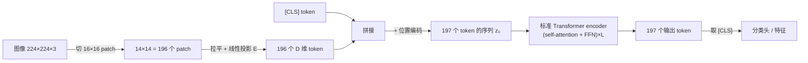

# ViT 与视觉编码器：把图像变成一串 token

!!! abstract "这一篇要回答什么"

    - 一张图像怎么变成 Transformer 吃得下的 token 序列？patch embedding 到底做了什么？
    - ViT 相比 CNN 扔掉了哪些归纳偏置，代价是什么——为什么它"吃数据"？
    - 一个图像 patch 凭什么变成一个"有语义"的 token？切出来的那一刻它有语义吗？
    - CLIP 怎么把图像和文本压进同一个空间？SigLIP 又改了哪一处？
    - 这些视觉 token 接下来怎么进入 VLM 的 LLM、或 DiT 的 cross-attention？

    对应论文：ViT (Dosovitskiy et al., 2020)、CLIP (Radford et al., 2021)、SigLIP (Zhai et al., 2023)。

!!! note "承接与去向"

    本篇承接 [基础 · Transformer](../foundations/transformer.md) 第 8 节埋下的引子（"ViT = 把图像切 patch 变 token，之后照搬标准 encoder"），把那一句话展开。

    范围只到**"图像怎么变 token + 这些 token 怎么获得语义"**。视觉 token 再经 projector / Q-Former 接进 LLM 的**模态对齐**，留给后续 `alignment.md`；文生图里文本条件如何注入，见 [DiT 条件机制](../dit/conditioning.md)。

## 1. 为什么非要把图像变成 token

Transformer 只认**序列**——一串 token，彼此之间用 attention 做"任意两位置一步直达"（见 [Transformer 篇](../foundations/transformer.md) 第 1 节）。可图像是个 2D 像素网格，不是序列。要让图像享受到 attention 的长程建模能力，第一步就得把它铺平成一串 token。

最朴素的想法是**每个像素当一个 token**。立刻撞墙：一张 \(224\times224\) 的图有 \(50176\) 个像素，注意力矩阵是 \(L^2\approx 2.5\times10^9\) 项——这正是 [Transformer 篇](../foundations/transformer.md) 第 7 节那个 \(L^2\) 代价在视觉上的爆炸形态。

ViT 的破局点简单得近乎粗暴：**不以像素为单位，以 patch 为单位**。把图像切成 \(16\times16\) 的小块，\(224\times224\) 就只剩 \(14\times14=196\) 个 patch，也就是 \(196\) 个 token——比逐像素少了 \(256\) 倍。序列长度回到 Transformer 舒适的量级，图像就此变成一个标准的序列问题。

## 2. Patchify：图像 → token 序列的三步

### 2.1 切块 + 线性投影（patch embedding）

给定图像 \(\mathbf{x}\in\mathbb{R}^{H\times W\times C}\)，选定 patch 边长 \(P\)（典型 \(P=16\)）：

1. 切成 \(N=\dfrac{HW}{P^2}\) 个互不重叠的 patch，每个 patch 是 \(P\times P\times C\) 的小块；
2. 把每个 patch **拉平**成一个 \(P^2\cdot C\) 维向量；
3. 过一个**共享的线性层** \(\mathbf{E}\in\mathbb{R}^{(P^2C)\times D}\)，投影成 \(D\) 维——这就是一个 token。

\[
\mathbf{z}_p^{(i)} = \mathbf{x}_p^{(i)}\mathbf{E},\qquad \mathbf{x}_p^{(i)}\in\mathbb{R}^{P^2C},\quad i=1,\dots,N
\]

!!! note "patch embedding 其实就是一个卷积"

    "切块 + 拉平 + 线性投影"三步，等价于一个 **kernel size = stride = \(P\)、输出通道 = \(D\) 的卷积**。主流实现（timm、HF）就是这么写的：一层 `Conv2d(C, D, kernel_size=P, stride=P)` 一步到位。所以别被"ViT 完全抛弃卷积"的说法误导——它在最前面的 tokenize 那一步保留了一个**不重叠**的卷积，抛弃的是 CNN 主干里层层堆叠的**重叠**卷积。

### 2.2 [CLS] token 与位置编码

投影完还差两样东西：

- **一个 [CLS] token**：一个可学习的向量，拼在 \(N\) 个 patch token 前面，位置 0。它不对应任何 patch，作用是在 self-attention 里**充当全局信息的汇聚点**——分类头最后就挂在它的输出上。（后来很多模型改用对所有 patch token 做 mean pooling，效果相近，少一个特殊 token。）
- **位置编码**：attention 本身对顺序无感（[Transformer 篇](../foundations/transformer.md) 第 6 节），而 patch 的空间位置显然重要。ViT 用**可学习的 1D 位置编码** \(\mathbf{E}_{\text{pos}}\)，直接加到每个 token 上。注意是把 \(14\times14\) 的网格**拉平成 1D** 再编号——ViT 没有显式告诉模型"哪两个 patch 上下相邻"，这个 2D 结构也得靠数据自己学出来。

合起来，进入 Transformer 的初始序列是：

\[
\mathbf{z}_0 = [\,\mathbf{x}_{\text{cls}};\ \mathbf{x}_p^{(1)}\mathbf{E};\ \dots;\ \mathbf{x}_p^{(N)}\mathbf{E}\,] + \mathbf{E}_{\text{pos}},\qquad \mathbf{E}_{\text{pos}}\in\mathbb{R}^{(N+1)\times D}
\]

### 2.3 之后就是一个标准 Transformer encoder

从 \(\mathbf{z}_0\) 往后，ViT **和 BERT 几乎一模一样**：\(L\) 层 `[多头 self-attention + FFN + 残差 + LayerNorm]`（Pre-LN 接法，见 [Transformer 篇](../foundations/transformer.md) 第 5 节），纯 self-attention，没有 cross-attention，也没有因果掩码（图像 patch 之间没有"先后"，可以互相看全）。

**一句话**：ViT 的全部创新只在"§2.1–2.2 怎么把图像变成 token 序列"这几步；一旦变成序列，后面就是照搬 NLP 的 Transformer。它证明了**图像不需要卷积主干，序列建模那一套直接能用**。

## 3. ViT 怎么训练，以及它为什么"吃数据"

### 3.1 原始 ViT：就是监督图像分类

最初的 ViT 训练目标平平无奇：**图像分类 + 交叉熵**。把 [CLS] token 的输出接一个线性分类头，预测类别，和标签算 cross-entropy，反向传播。和训练一个 ResNet 没有本质区别——**换的只是主干网络**，损失函数、数据形态都没变。

真正的故事在数据规模上。

### 3.2 它扔掉的归纳偏置，得用数据补回来

CNN 的架构里**内置了两条关于图像的先验知识**（归纳偏置，inductive bias）：

- **局部性 (locality)**：卷积核只看局部邻域，默认"相邻像素更相关"；
- **平移等变 (translation equivariance)**：同一个核在整张图上滑动、权重共享，默认"物体挪个位置，特征跟着挪，识别不变"。

这两条是人**手工设计进架构**的，等于免费送给模型的先验。ViT 几乎全扔了：除了最前面切 patch 那一下，它对"图像"一无所知——哪些 patch 相邻、平移不变性，统统没有内置，**全靠 attention 从数据里自己学**。

后果非常鲜明，也是 ViT 论文最重要的结论：

| 训练数据规模 | ViT vs 同级 CNN(ResNet) |
|---|---|
| ImageNet-1k（~130 万张） | ViT **打不过** ResNet——数据不够，学不出该有的先验 |
| ImageNet-21k（~1400 万） | 打平 |
| JFT-300M（~3 亿张） | ViT **反超**，且随规模持续拉开 |

结论掷地有声：**归纳偏置是数据的替代品**。数据稀缺时，手工先验帮你省数据；数据足够多时，模型从数据里学到的先验**比手工设计的更好、更灵活**，手工偏置反而成了枷锁。这正是"大数据 + 弱先验的通用架构"这条路线（Transformer 一统天下）在视觉上的复现。

### 3.3 回答你的问题：patch 凭什么变成"有语义"的 token

你问的"如何做到图像 patch 和 token 的对齐"，关键要先破一个直觉误区：

> **切出来的那一刻，patch token 没有任何语义。**

训练开始前，patch embedding 的 \(\mathbf{E}\) 是随机初始化的线性投影，一个 patch 过它得到的 \(D\) 维向量只是**像素值的随机线性组合**，不代表"猫耳朵"或"天空"任何东西。

语义是**训练信号塑造出来的**。分类 loss 反向传播时，会同时逼迫两件事发生：

1. **逼 attention 学会聚合**——为了让 [CLS] 输出能正确分类，attention 必须学会"把相关 patch 的信息汇集到 [CLS]"（比如识别猫时，多关注含猫的那些 patch）；
2. **逼 patch token 编码有用特征**——梯度顺着流回 \(\mathbf{E}\)，逼它把 patch 投影成"对分类有用"的表示。可视化会看到浅层 token 抓边缘/纹理，深层 token 抓部件/物体——和 CNN 学到的层级特征惊人地相似，只不过是 attention 自己涌现出来的。

所以"patch 和 token 的对齐"不是一个几何切分动作，而是**语义习得的结果**：切 patch 只提供了一个**位置容器**（第 \(i\) 块图像 → 序列第 \(i\) 个槽位），至于这个槽位里最终装进什么语义，完全由训练目标决定。换个训练目标（下一节的图文对比），同样的 patch 会学出完全不同、且能和语言对话的语义。

## 4. 从"看图分类"到"图文对齐"：CLIP

### 4.1 监督分类的天花板

分类训练有个死结：类别表是**固定且封闭**的。ImageNet 只有 1000 类，模型的语义被锁死在这 1000 个离散标签里——遇到表外的概念就抓瞎，更没法和自然语言对话。而你的目标（文本和图像做 cross-attention）恰恰要求：**图像和文本落在同一个、连续的、可比较的语义空间里**。分类给不了这个。

### 4.2 对比学习：CLIP 怎么把图文压进同一个空间

CLIP 换了训练信号：不再用"图→类别标签"，而用**"图→配套的文字描述"**，从 4 亿网络图文对里学。架构是**双塔**：

- **图像塔**：一个 ViT（或 ResNet），把图像编码成向量 \(\mathbf{I}\)；
- **文本塔**：一个 Transformer，把文字编码成向量 \(\mathbf{T}\)。

训练用**对比学习 (contrastive learning)**：取一个含 \(N\) 对图文的 batch，两两算相似度，得到 \(N\times N\) 矩阵。**对角线上的 \(N\) 对是真实配对（正例），要拉近；其余 \(N^2-N\) 个都是错配（负例），要推远。**

先定义相似度矩阵的每个元素（\(\tau\) 是温度，见 [Transformer 篇](../foundations/transformer.md) 2.3 的展开注）：

\[
s_{ij}=\frac{\mathbf{I}_i\cdot\mathbf{T}_j}{\tau\,\lVert\mathbf{I}_i\rVert\,\lVert\mathbf{T}_j\rVert}
\]

**图 → 文方向**：把第 \(i\) 行（图 \(i\) 对全 batch 文本的相似度）做 softmax，正确答案的 label 是 \(i\)（对角），所以这一行的交叉熵就是 \(-\log\) 对角那一格的概率：

\[
p^{\text{i}\to\text{t}}_{ii}=\frac{\exp(s_{ii})}{\displaystyle\sum_{k=1}^{N}\exp(s_{ik})},
\qquad
\mathcal{L}_{\text{i}\to\text{t}}=-\frac1N\sum_{i=1}^{N}\log p^{\text{i}\to\text{t}}_{ii}
\]

**文 → 图方向**：把第 \(j\) 列（文 \(j\) 对全 batch 图像的相似度）做 softmax，label 同样是对角 \(j\)：

\[
p^{\text{t}\to\text{i}}_{jj}=\frac{\exp(s_{jj})}{\displaystyle\sum_{k=1}^{N}\exp(s_{kj})},
\qquad
\mathcal{L}_{\text{t}\to\text{i}}=-\frac1N\sum_{j=1}^{N}\log p^{\text{t}\to\text{i}}_{jj}
\]

总损失是两个方向的平均：

\[
\mathcal{L}=\tfrac12\big(\mathcal{L}_{\text{i}\to\text{t}}+\mathcal{L}_{\text{t}\to\text{i}}\big)
\]

**label 藏在哪？** 就藏在"\(-\log\) 取的是**对角**那一格 \(p_{ii}\)"这件事上——分母遍历整行（所有候选在竞争），分子却**只取对角** \(\exp(s_{ii})\)。取哪一格作为 \(-\log\) 的对象，就是 label 在起作用；因为 batch 里第 \(i\) 张图配的就是第 \(i\) 段文，label 恒等于行号（列号）。两个方向的差别只在**归一化的分母**：图→文按行归一（图 \(i\) 在所有文本里竞争），文→图按列归一（文 \(j\) 在所有图像里竞争）——这正对应"每张图选对它的文"与"每段文选对它的图"。

这一套的产物正是你要的东西：**图像和文本被压进同一个 embedding 空间，一张图的向量和描述它的句子的向量，cosine 相似度很高**。此时"图文对齐"是字面意义上的——两个模态的向量在同一空间里直接可比、可做点积、可做 attention。开放词表分类、图文检索、以及 VLM 里"视觉 token 和文本 token 互相理解"，都从这个共享空间来。

!!! note "为什么对比学习需要"很多负例""

    CLIP 的信号强度来自**负例的数量**：每个正例要在"同 batch 其余所有错配"的衬托下被挑出来，batch 越大、负例越多，任务越难、学到的表示越判别性强。所以 CLIP 用了极大的 batch（32768），也因此对算力和显存很敏感——这直接引出下一节 SigLIP 的改动。

### 4.3 SigLIP：把 softmax 换成 sigmoid

CLIP 的 softmax 有个隐藏成本：它要在**整个 batch 上做归一化**（每一行的分母是该图与 batch 内所有文本的相似度之和），因此负例必须是全局的，多卡训练还得 all-gather 把所有样本的 embedding 凑齐——batch 一大，通信和显存都吃紧。

SigLIP（Zhai et al., 2023）把损失从 softmax 换成 **sigmoid**：不再问"这张图在 batch 里最该配哪段文"，而是对**每一个 \((\text{图}_i,\text{文}_j)\) 组合独立地问一个是非题**——"这俩是不是一对？"，做二分类：

\[
\mathcal{L} = -\sum_{i}\sum_{j}\log\sigma\!\Big(z_{ij}\,(t\cdot \mathbf{I}_i\cdot\mathbf{T}_j + b)\Big),\qquad z_{ij}=\begin{cases}+1 & i=j\ (\text{配对})\\ -1 & i\neq j\ (\text{错配})\end{cases}
\]

关键差别：sigmoid loss **在每个图文对上独立计算，不需要跨整个 batch 归一化**。于是不必强行堆大 batch、不必全局 all-gather，小算力下反而训得更好、更稳。

这里又撞见那个反复出现的取舍——**softmax（全局归一化、逐样本竞争） vs sigmoid（逐元素独立、各判各的）**。和你在别处见过的分类 vs 多标签、注意力 vs 门控是同一个母题：要不要让所有候选在一个分母里互相竞争。CLIP 选了竞争，SigLIP 说很多时候不必。

## 5. 这些 token 接下来去哪

ViT 把"图像 → token 序列"这条路铺好、CLIP/SigLIP 再把这些 token 校准到和语言共享的空间之后，图像就正式站上了能和文本做 attention 的舞台。往下分两条主线：

- **VLM（本主线）**：把（CLIP/SigLIP 的）视觉 token 经一个 **projector** 投影后，接进 LLM 的上下文，与文本 token 一起参与 attention。所谓"模态对齐"，很大程度就是让视觉 token 落进 LLM 的 K/V 读得懂的表示空间——这是下一篇 `alignment.md` 的主题（projector / Q-Former / cross-attention 三条路线）。
- **DiT / 文生图**：注意分工不同——图像那一侧用的是 **VAE latent 切 patch**（见 [Latent Diffusion](../dit/latent-diffusion.md)），不是 ViT；但"切 patch 变 token"的机制同源。文本那一侧则常直接借 **CLIP/T5 的 text encoder** 产出条件 token，经 cross-attention 注入去噪网络（见 [DiT 条件机制](../dit/conditioning.md)）。

!!! note "一处容易混的地方：ViT 的 patchify ≠ DiT 的 patchify"

    两处都叫"切 patch 变 token"，但切的对象不同：**ViT 切的是原始像素**（tokenize 后送去*理解*）；**DiT 切的是 VAE 压缩后的 latent**（tokenize 后送去*去噪生成*）。机制同源、目的相反——一个把图像读成语义，一个从噪声里写出图像。这也正是本站 VLM（理解）与 DiT（生成）两条地基的分野。
